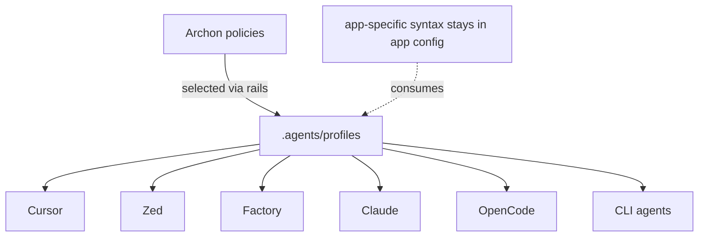

# Agent configs & profiles

Agent apps (Claude, Cursor, Zed, Factory, OpenCode, CLI agents) each have their own prose config.
Left alone, the same intent — what an agent may touch, which commands it may run, whether it can
read secrets — gets restated five times. WfOS consolidates that intent into **shared profiles**
and keeps each `AGENTS.md` lean.

## Shared profiles

A profile is one declaration consumed by every app. Profiles live at
[`Workstreams/.agents/profiles/`](../../../../../.agents/profiles/README.md) as tracked TOML; each
declares scope (allowed/blocked paths), command allow/gate/block lists, secret access, a
remote-write policy, required validators, an output compressor, and a session-log target. Apps
consume the shared intent through their own (chezmoi-rendered) config syntax — they never become a
second policy source of truth.

[Archon](metadata-plane.md) policies remain the enforcement authority. A profile *selects* a
policy through its `rails` field and *scopes* it. `archon validate` checks every profile against
`schemas/profile.schema.json`; `archon sync` flattens them into `registry/profiles.json` and draws
`profile → selects → policy` edges in the project graph.

## App integration pattern

Rules:

- Keep shared policy in the registry.
- Keep app-specific syntax in app config.
- Do not duplicate secrets across agent configs.
- Do not let app configs bypass toolkit rails.
- Prefer one task per agent session.
- Require logs for autonomous routines.

The wiring from each app to the profile data is recorded in the routing contract
([`packages/dust/dotfiles/.chezmoidata/routing.toml`](../packages/dust/dotfiles/.chezmoidata/routing.toml)):
for every app, `consumes_profile_data = true` and `holds_secrets = false`.

## The lean `AGENTS.md` pattern

`AGENTS.md` is a **pointer, not a manual**. It carries only:

- core rules (substrate, run-from-root, native manifests stay authoritative, stay within rails),
- a short may / may-not table,
- key paths,
- the profile the workspace runs under,
- a skills note.

Detailed commands and architecture live in `README.md` and `docs/`, loaded on demand — so opening
`AGENTS.md` stays cheap. No app-specific prose duplicates profile intent: scope, command
allow/block lists, and secret rules are declared once in the profile, not retold per app or per
`AGENTS.md`. The copy-ready template is
[`.agents/profiles/AGENTS.template.md`](../../../../../.agents/profiles/AGENTS.template.md); the
reference instance is this workspace's [`AGENTS.md`](../AGENTS.md).

## Why it matters for token cost

Every app's prose config is context an agent loads. One profile means the same intent is declared
once and consumed everywhere, instead of duplicated as prose in five places. Scoped profiles also
load only the allowed paths and commands for a task, so irrelevant context never enters the
prompt, and a lean `AGENTS.md` keeps per-workspace instructions short. Shared profile + lean
`AGENTS.md` replaces per-app prose sprawl.

## Related

- [Agent rails and gates](agent-rails.md) — the rails, gates, and the SkillSpector skill gate.
- [Metadata plane](metadata-plane.md) — Archon descriptors, policies, registry, and graph.
- [`.agents/profiles/README.md`](../../../../../.agents/profiles/README.md) — the profile contract.
