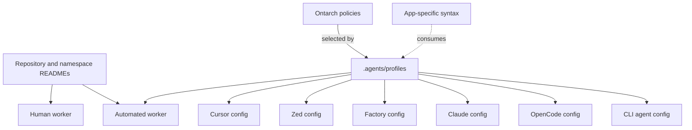

# Agent configs and profiles

Agent applications—Claude, Cursor, Zed, Factory, OpenCode, CLI agents, and future interfaces—each
have their own configuration syntax. WfOS keeps that syntax at the application edge while
consolidating shared operating intent into **agent profiles**, Ontarch policies, and generated
registry data.

Repository and namespace instructions are not agent-only. Humans and automated workers enter
through the same maintained `README.md` files.

## Instruction placement

| Concern | Home |
|---|---|
| Repository purpose, namespace map, first commands, and authority links | root or nearest `README.md` |
| Detailed product, architecture, setup, and runbook material | normal `docs/` and package documentation |
| Session scope, allowed paths, command classes, validators, isolation, skills, and logs | `.agents/profiles/*.toml` |
| Reusable command and resource rails | `packages/ontarch/policies/*.toml` |
| Reusable profile, skill, tool, and graph navigation contracts | `packages/ontarch/patterns/agents/` |
| App-specific settings and rendering syntax | each application's own config |
| Generated profile, policy, skill, tool, and relationship projections | Ontarch registry and graph |

This prevents a parallel instruction hierarchy. README files explain the workspace to everyone;
profiles and policies narrow automated behavior without duplicating the workspace manual.

## Shared profiles

A profile is one declaration consumed by every compatible agent application. Profiles live in the
working agent-navigation layer at `$AGENTS_HOME/profiles/`—commonly
`Workstreams/.agents/profiles/` when WfOS is embedded in that layout.

Each profile may declare:

- allowed and blocked paths;
- allowed, gated, and blocked command patterns;
- secret access and remote-write posture;
- worktree or branch isolation intent;
- required validators;
- allowed skills and external-skill loading;
- output-compressor intent;
- build-session log targets;
- optional runtime-controller session-state location.

Applications consume this shared intent through their own configuration syntax. They must not
become a second policy authority or duplicate secrets.

The reusable seed lives in
[`packages/ontarch/patterns/agents/`](../packages/ontarch/patterns/agents/README.md). Materialize or
refresh a working `.agents/` layer with:

```bash
moon run ontarch:agents-init
```

The command skips existing files unless `--force` is supplied and records the source pattern in
`.pattern-lock`.

## Policy relationship

Ontarch policies remain the reusable rule authority. A profile selects and scopes those policies.
For example:

- `panoply.agent` describes native-toolchain restrictions in agent mode;
- `agent-git` governs cross-cutting Git allow, gate, and block behavior;
- `no-agent-git-push` records the default publish boundary;
- `agent-bin` describes bin/archive behavior.

`ontarch validate` checks profiles against `schemas/profile.schema.json` and verifies policy,
skill, and command relationships. `ontarch sync` flattens valid authored inputs into generated
registry projections and graph edges.

## App integration pattern


```mermaid
flowchart TD
  Readme["Repository and namespace READMEs"] --> Human[Human worker]
  Readme --> Agent[Automated worker]

  Policies["Ontarch policies"] -->|selected by| Profiles[".agents/profiles"]
  Profiles --> Agent

  Profiles --> Cursor[Cursor config]
  Profiles --> Zed[Zed config]
  Profiles --> Factory[Factory config]
  Profiles --> Claude[Claude config]
  Profiles --> OpenCode[OpenCode config]
  Profiles --> Shell[CLI agent config]

  AppSyntax["App-specific syntax"] -. consumes .-> Profiles
```

Rules:

- Keep universal workspace guidance in README files and normal docs.
- Keep shared automated intent in profiles and policies.
- Keep app-specific syntax in app config.
- Do not duplicate secrets across agent configs.
- Do not let app configs bypass WfOS rails.
- Prefer one bounded task per automated session.
- Require provenance records for autonomous routines.

The app-routing contract lives at
[`packages/panoply/dotfiles/.chezmoidata/routing.toml`](../packages/panoply/dotfiles/.chezmoidata/routing.toml).
Every app declares that it consumes profile data and does not hold secrets.

## Two profile layers

WfOS carries two different profile concepts:

| Layer | Home | Question answered | Consumed by |
|---|---|---|---|
| **Agent operating profile** | `$AGENTS_HOME/profiles/*.toml` | What may this automated session touch and run? | Agents, Ontarch validation/sync, app renderers |
| **Machine or chezmoi profile** | `packages/panoply/dotfiles/.chezmoidata/profiles.toml` | Which configuration targets render on this host? | chezmoi templates |

Do not conflate them. An agent profile expresses session intent and policy selection. A machine
profile controls host rendering.

Output-compressor intent is currently recorded in the generated profile registry, while the
Claude and shell RTK integrations gate on machine-profile rendering. Until those paths are fully
bridged, keep the active machine setting aligned with the selected agent profile.

## README-first entrypoint pattern

A maintained namespace uses this small shape:

```text
workspace-or-package/
├── README.md          shared entrypoint for humans and automated workers
├── docs/              detailed explanations and runbooks
├── native manifests  authoritative build and dependency contracts
└── child/
    └── README.md      child namespace entrypoint
```

The README should remain concise:

- purpose and scope;
- namespace or package map;
- first commands;
- important authority boundaries;
- links to detailed docs, manifests, policies, state, and tests.

It should not restate full profile command lists, secret rules, or application-specific agent
configuration. Those details remain queryable from their actual contracts.

## Why this reduces context cost

One README entrypoint avoids separate human and agent manuals drifting apart. One shared profile
avoids restating the same scope and policy intent in every agent application's prose format.
Generated registry queries then provide compact task-specific context without requiring a full
repository scan.

## Related

- [Worker guidance](worker-guidance.md)
- [Agent rails and gates](agent-rails.md)
- [Agent skills](agent-skills.md)
- [Metadata plane](metadata-plane.md)
- [Agents-navigation pattern](../packages/ontarch/patterns/agents/README.md)
