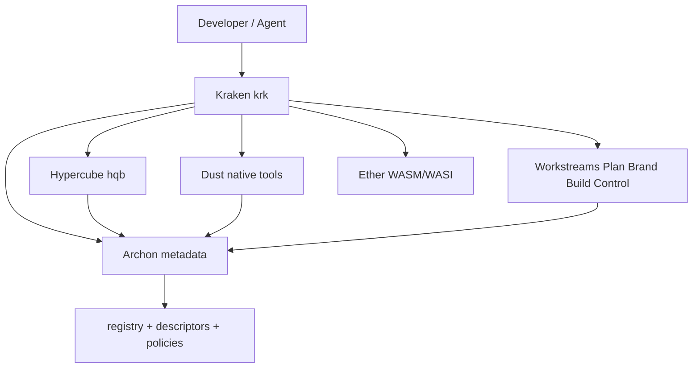

# Architecture

WfOS Level 0 is the lowest practical layer of a Workflows Operating System: the local
machine, dev server, or sandbox where work actually happens. It does not replace your OS,
shell, package managers, or build tools — it organizes them, routes to them, and exposes
their meaning through a consistent local interface.

The layer should be boring, practical, and powerful. It is **local-first** (no network or
cloud account required to be useful), **configuration-driven** (metadata and policy define
what exists and how it connects), and **modular** (every part is optional and swappable).

## Archetypes vs products

WfOS separates **what a component does** (archetype) from **what it is called here**
(product / brand). Use archetypes in contracts and configs; use product names for the
implementations in this workspace and their CLIs.

| Archetype id | Purpose | Product | CLI |
|--------------|---------|---------|-----|
| `runtime-controller` | Discovery, routing, sessions, rails | Kraken | `krk` |
| `package-translator` | High-level intent → packages, artifacts | Hypercube | `hqb` |
| `native-substrate` | Native Unix/Rust tools and scripts | Dust | `dust` |
| `portable-runtime` | WASM/WASI sandboxed components | Ether | — |
| `metadata-plane` | Descriptors, registry, schemas, policies | Archon | — |
| `agent-interface` | Scoped agent/daemon layer (planned) | Casper | — |

Another configuration could implement `runtime-controller` with a different product or
collapse several archetypes behind one CLI — the archetype ids stay stable in metadata.

## Interface layers

Above the filesystem, three interface layers expose the system at the depth that matches
how someone works. Most operators never touch raw paths; they work through the layer that
fits their level.

```txt
Toolchain layer (low)     configs, tools, libraries, CLIs, dotfiles, native manifests
Agent layer   (mid)       agents, skills, prompts, rails, MCP surfaces, scoped graphs
Application layer (high)  apps, sites, dashboards — minimal path surface
```

A developer lives mostly in the toolchain layer. An agent operator works through the agent
layer (scoped skills and tools, not folder trees). A reader of the docs site only sees the
application layer. [Archon](metadata-plane.md) binds these layers to what lives on disk: full
abstraction for higher levels, direct access for lower levels when needed.

## Workstreams collection

The **`Workstreams/`** tree lives outside this workspace. It organizes work across four
namespaces — each with its own role, typical artifacts, and promotion gates between them.
Archon registers units from these namespaces so Kraken and agents can route without crawling
raw paths.

| Namespace | Role | Typical artifacts | Gate to next |
|-----------|------|-------------------|--------------|
| **Plan** | Decisions — briefs, specs, strategy | fleeting capture (`bin/`), validated specs (`src/`) | validated → Build |
| **Brand** | Expressions — design, content, voice | design tokens, copy, export-ready assets | approved → Build |
| **Build** | Implementations — code, workspaces, data science | repos (`src/workspaces/`), packages, pipelines | ship-ready → Control |
| **Control** | Operations — records, sync, release | ledgers, deployment records, sync state | — |

**Interface layers and gates.** Content moves through the same three interface layers described
above (toolchain → agent → application). Promotion between namespaces is gated: Plan content must
be validated before Build implements it; Brand assets must be approved before they ship; Build
artifacts must be ship-ready before Control records a release. Kraken (`krk`) is the design
target for exposing these gates as routable commands (`krk plan`, `krk build`, `krk qa`, etc.).

**Filesystem layout.** On a typical machine, Workstreams roots sit alongside each other under
`~/Workstreams/` (or your chosen mount — the namespace names are conventions, not requirements).
WfOS itself often lives under `Build/src/workspaces/wfos/` in that layout; if yours differs,
set `DUST_HOME` to your Dust package path (see [setup.md](setup.md#dust_home-and-workstreams-layout)).

## System map



Kraken reads Archon, routes commands, runs native tools through Dust and portable components
through Ether, and asks Hypercube to translate higher-level intent into packages. Archon is
the shared meaning underneath all of it.

## Principles

- **Native manifests stay authoritative.** Archon describes meaning, routing, policy, and
  relationships; it never replaces `Cargo.toml`, `package.json`, `mise.toml`, or a lockfile.
- **Swappable by default.** fzf ↔ skim, tmux ↔ zellij, mise ↔ proto, git ↔ jj. Nothing
  hard-locks a workflow; the controller detects and routes.
- **Local-first scope.** Everything works offline. Remotes, sync, and federation are layers
  you add later, not prerequisites.
- **Non-disruptive adoption.** Use one package without the rest. Keep your existing shell,
  prompt, and editor; let WfOS slot in beside them.

## Where to go next

- Engine internals and the CLI/daemon/TUI plan: [runtime-architecture.md](runtime-architecture.md)
- How the workspace is built and tasks run: [monorepo.md](monorepo.md)
- The implemented pair: [native-substrate.md](native-substrate.md) and [metadata-plane.md](metadata-plane.md)
