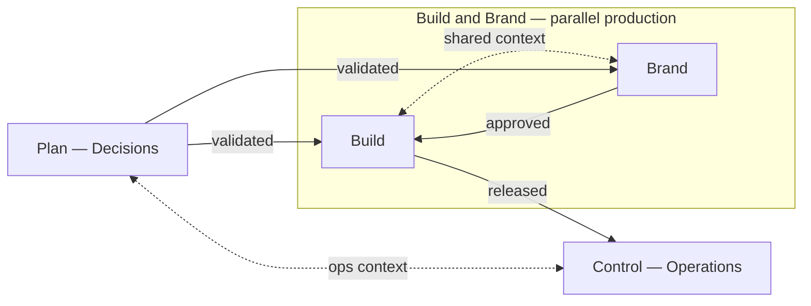
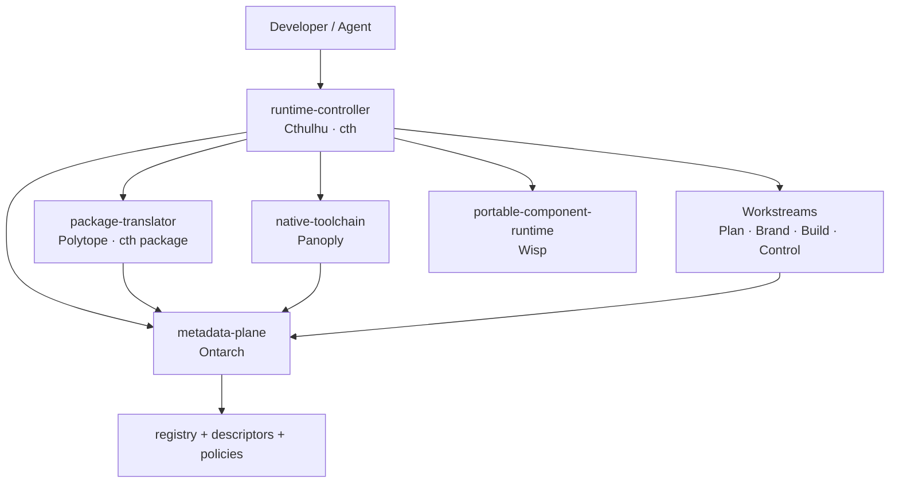

# Architecture

WfOS Level 0 is the lowest practical layer of a Workflows Operating System: the local
machine, dev server, or sandbox where work actually happens. It does not replace your OS,
shell, package managers, or build tools — it organizes them, routes to them, and exposes
their meaning through a consistent local interface.

The layer should be boring, practical, and powerful. It is **local-first** (no network or
cloud account required to be useful), **configuration-driven** (metadata and policy define
what exists and how it connects), and **modular** (every part is optional and swappable).

## Archetypes vs products

WfOS separates **what a component does** (archetype) from **what it is called here**
(product / brand). Use archetypes in contracts and configs; use product names for the
implementations in this workspace and their CLIs.

| Archetype id | Purpose | Product | CLI |
|--------------|---------|---------|-----|
| `runtime-controller` | Discovery, routing, sessions, rails | Cthulhu | `cth` |
| `package-translator` | High-level intent → packages, artifacts | Polytope | `cth package` |
| `native-toolchain` | Native Unix/Rust tools and scripts | Panoply | `panoply` |
| `portable-component-runtime` | WASM/WASI sandboxed components | Wisp | — |
| `metadata-plane` | Descriptors, registry, schemas, policies | Ontarch | — |

Another configuration could implement `runtime-controller` with a different product or
collapse several archetypes behind one CLI — the archetype ids stay stable in metadata.

### Future archetype — `agent-interface`

Outside the current Level 0 package set, WfOS reserves the future archetype
`agent-interface` for a scoped agent/daemon layer over the `runtime-controller` (Cthulhu)
and `metadata-plane` (Ontarch). No product brand is adopted for it yet. See the Level 0
namespace alignment §17 for the conceptual surface; do not treat it as a core package,
CLI, or repository requirement today.

## Interface layers

Above the filesystem, three interface layers expose the system at the depth that matches
how someone works. Most operators never touch raw paths; they work through the layer that
fits their level.

```txt
Toolchain layer (low)     configs, tools, libraries, CLIs, dotfiles, native manifests
Agent layer   (mid)       agents, skills, prompts, rails, MCP surfaces, scoped graphs
Application layer (high)  apps, sites, dashboards — minimal path surface
```

A developer lives mostly in the toolchain layer. An agent operator works through the agent
layer (scoped skills and tools, not folder trees). A reader of the docs site only sees the
application layer. The [metadata plane (Ontarch)](metadata-plane.md) binds these layers to what
lives on disk: full abstraction for higher levels, direct access for lower levels when needed.

## Workstreams collection

The **`Workstreams/`** tree lives outside this workspace. It organizes work across four
namespaces — each with its own role, typical artifacts, and promotion gates between them.
The metadata plane registers units from these namespaces so the runtime controller and agents
can route without crawling raw paths.

Plan sits on the left and Control on the right. Between them, **Build and Brand work in
parallel** inside one production cluster: each gated from Plan, integrating with each other,
and releasing into Control. Context and feedback also circulate so the loop stays agile
rather than rigidly linear.



Shape in short: `Plan ←[gates]→ | Build ←→ Brand | ←[gates]→ Control`.

| Namespace | Role | Typical artifacts | Gate |
|-----------|------|-------------------|------|
| **Plan** | Decisions — briefs, specs, strategy | fleeting capture (`bin/`), validated foundation (`src/`) | **`validated`** → Build and Brand in parallel |
| **Brand** | Expressions — design, content, voice | design tokens, copy, export-ready assets | **`approved`** → Build (integration) |
| **Build** | Implementations — code, workspaces, data science | repos (`src/workspaces/`), packages, pipelines | **`released`** → Control |
| **Control** | Operations — records, sync, release | ledgers, deployment records, sync state | feeds vision / priorities back to Plan |

**Interface layers and gates.** Content moves through the same three interface layers described
above (toolchain → agent → application). Promotion between namespaces is gated: Plan foundation
must be **validated** before Build and Brand each start their own specs (Build does not wait on
Brand); Brand assets must be **approved** before Build integrates them; Build artifacts must be
**released** before Control records a shipment. Solid arrows are those checkpoints. Dotted edges
carry shared context, feedback, and ops priorities — the agile inner loop inside the production
container, while Control still sees a clean outer waterfall.

The `runtime-controller` (Cthulhu, `cth`) is the design target for exposing these gates as
routable commands via `cth workstream` (with profile aliases such as `cth plan`, `cth qa`, and
`cth release`; Build-namespace entry is `cth workstream build` — top-level `cth build` stays
unit lifecycle). See [runtime-controller.md#workstream-routing](runtime-controller.md#workstream-routing).

**Filesystem layout.** On a typical machine, Workstreams roots sit alongside each other under
`~/Workstreams/` (or your chosen mount — the namespace names are conventions, not requirements).
WfOS itself often lives under `Build/src/workspaces/wfos/` in that layout; if yours differs,
set `PANOPLY_HOME` to your native-toolchain package path (see [setup.md](setup.md#panoply_home-and-workstreams-layout)).

## System map



The runtime controller reads the metadata plane, routes commands, runs native tools through the
native toolchain and portable components through the portable-component runtime, and asks the
package translator to turn higher-level intent into packages. The metadata plane is the shared
meaning underneath all of it.

## Principles

- **Native manifests stay authoritative.** The metadata plane describes meaning, routing, policy,
  and relationships; it never replaces `Cargo.toml`, `package.json`, `mise.toml`, or a lockfile.
- **Swappable by default.** fzf ↔ skim, tmux ↔ zellij, mise ↔ proto, git ↔ jj. Nothing
  hard-locks a workflow; the controller detects and routes.
- **Local-first scope.** Everything works offline. Remotes, sync, and federation are layers
  you add later, not prerequisites.
- **Non-disruptive adoption.** Use one package without the rest. Keep your existing shell,
  prompt, and editor; let WfOS slot in beside them.

## Where to go next

- Engine internals and the CLI/daemon/TUI plan: [runtime-architecture.md](runtime-architecture.md)
- How the workspace is built and tasks run: [monorepo.md](monorepo.md)
- The implemented pair: [native-toolchain.md](native-toolchain.md) and [metadata-plane.md](metadata-plane.md)
