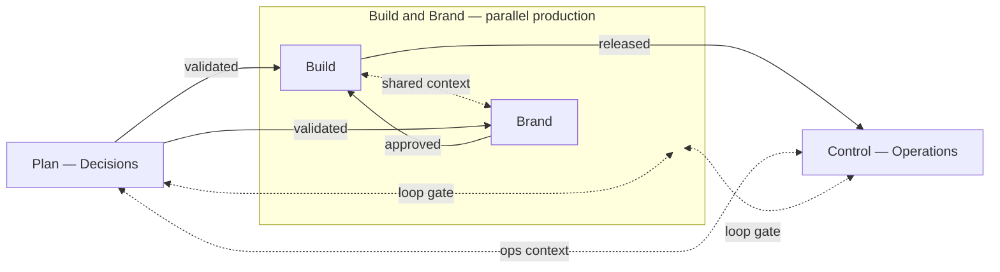
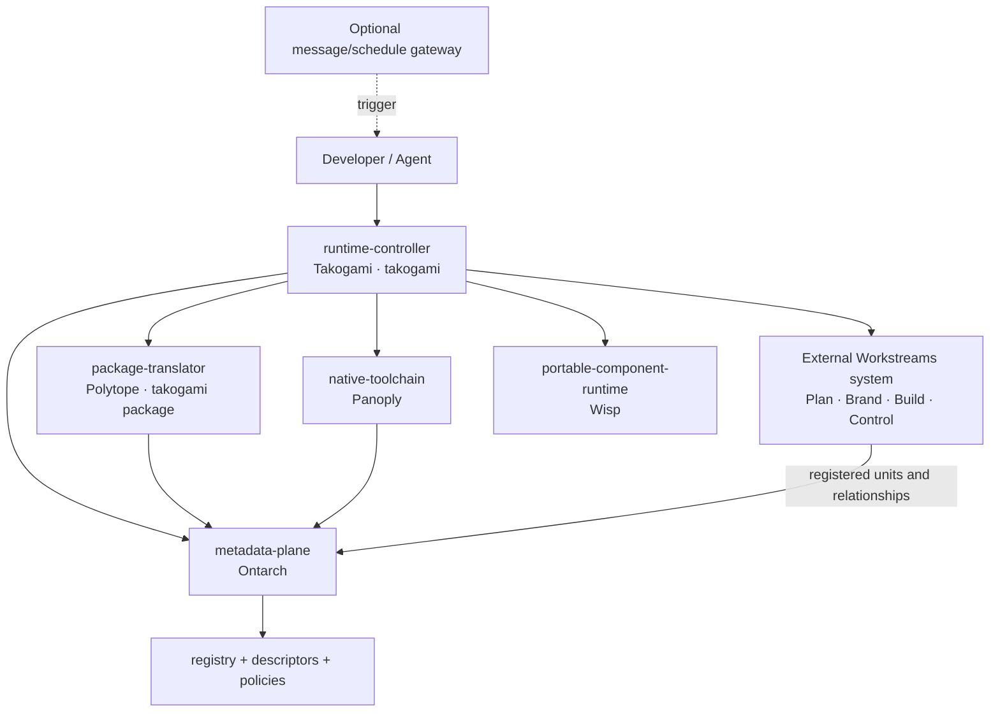

# Architecture

WfOS Level 0 is the lowest practical layer of a Workflows Operating System: the local
machine, dev server, or sandbox where work actually happens. It does not replace your OS,
shell, package managers, or build tools — it organizes them, routes to them, and exposes
their meaning through a consistent local interface.

The layer should be boring, practical, and powerful. It is **local-first** (no network or
cloud account required to be useful), **configuration-driven** (metadata and policy define
what exists and how it connects), and **modular** (every part is optional and swappable).

## Archetypes vs products

WfOS separates **what a component does** (archetype) from **what it is called here**
(product / brand). Use archetypes in contracts and configs; use product names for the
implementations in this workspace and their CLIs.

| Archetype id | Purpose | Product | CLI |
|--------------|---------|---------|-----|
| `runtime-controller` | Discovery, routing, sessions, rails | Takogami 🐙 | `takogami` |
| `package-translator` | High-level intent → packages, artifacts | Polytope 📦 | `takogami package` |
| `native-toolchain` | Native Unix/Rust tools and scripts | Panoply 🧰 | `panoply` |
| `portable-component-runtime` | WASM/WASI sandboxed components | Wisp 🫧 | — |
| `metadata-plane` | Descriptors, registry, schemas, policies | Ontarch 📐 | — |

Another configuration could implement `runtime-controller` with a different product or
collapse several archetypes behind one CLI — the archetype ids stay stable in metadata.

### Future archetype — `agent-interface`

Outside the current Level 0 package set, WfOS reserves the future archetype
`agent-interface` for a scoped agent/daemon layer over the `runtime-controller` (Takogami)
and `metadata-plane` (Ontarch). No product brand is adopted for it yet; do not treat it as a
core package, CLI, or repository requirement today.

An external message/schedule gateway is not this archetype. A narrow gateway such as
[Push](https://github.com/owainlewis/push) may trigger an existing Claude/Codex/Pi agent; that
agent then uses the profile-bound agent-interface/MCP or Takogami CLI. The gateway remains
optional and cannot bypass policy or provide WfOS approval.

## Interface layers

Above the filesystem, three interface layers expose the system at the depth that matches
how someone works. Most operators never touch raw paths; they work through the layer that
fits their level.

```txt
Toolchain layer (low)     configs, tools, libraries, CLIs, dotfiles, native manifests
Agent layer   (mid)       agents, skills, prompts, rails, MCP surfaces, scoped graphs
Application layer (high)  apps, sites, dashboards — minimal path surface
```

A developer lives mostly in the toolchain layer. An agent operator works through the agent
layer (scoped skills and tools, not folder trees). A reader of the docs site only sees the
application layer. The [metadata plane (Ontarch)](metadata-plane.md) binds these layers to what
lives on disk: full abstraction for higher levels, direct access for lower levels when needed.

## Workstreams collection

The **`Workstreams/`** tree lives outside this workspace. It organizes work across four
namespaces — each with its own role, typical artifacts, internal workflows, and promotion
gates. The metadata plane registers units from these namespaces so the runtime controller and
agents can route without crawling raw paths.

Workstreams is a separate operating system and semantic authority. WfOS may discover, route,
control, and record its units, but does not own or redefine the Workstreams model.

Plan sits on the left and Control on the right. Between them, **Build and Brand work in
parallel** inside one production cluster: each binds independently from Plan, they iterate
with each other, and Build releases into Control. Context, evidence, priorities, and feedback
circulate around the entire shape. The solid arrows below show promotion gates; the dotted
arrows show the wider recirculating operating loop.


```mermaid
flowchart LR
  Plan[Plan — Decisions]

  subgraph Prod [Build and Brand — parallel production]
    direction TB
    Build[Build]
    Brand[Brand]
    Build <-.->|shared context| Brand
    Brand -->|approved| Build

    %% Transparent lower anchor keeps the loop gate below the solid gates.
    LoopGate(( ))
    Brand ~~~ LoopGate
  end

  Control[Control — Operations]

  Plan -->|validated| Build
  Plan -->|validated| Brand
  Build -->|released| Control

  Plan <-.->|ops context| Control
  Plan <-.->|loop gate| LoopGate
  LoopGate <-.->|loop gate| Control

  classDef loopAnchor fill:transparent,stroke:transparent,color:transparent,stroke-width:0px;
  class LoopGate loopAnchor;
```

Shape in short: `↻ Plan ←[gates]→ | ←[gates]→ Build ←[gates]→ Brand ←[gates]→ | ←[gates]→ Control ↻`.

| Namespace | Role | Typical artifacts | Gate |
|-----------|------|-------------------|------|
| **Plan** | Decisions — foundations, strategy, architecture | fleeting capture (`bin/`), validated foundations and canon (`src/`) | **`validated`** → Build and Brand in parallel |
| **Brand** | Expressions — design, content, voice, marketing | design tokens, copy, campaign packages, export-ready assets | **`approved`** → Build integration |
| **Build** | Implementations — code, infrastructure, systems, data and assurance | repos (`src/workspaces/`), packages, pipelines, implementation specs, test evidence | **`released`** → Control |
| **Control** | Operations — records, deployment, governance, finance and coordination | ledgers, deployment records, sync state, policies | operational evidence and priorities recirculate through the system |

**Interface layers and gates.** Content moves through the same three interface layers described
above (toolchain → agent → application). Promotion between namespaces is gated: a Plan foundation
must be **validated** before Build and Brand each start their own downstream planning and production
(Build does not wait on Brand); Brand assets must be **approved** before Build integrates them;
Build artifacts must be **released** before Control records and operates a shipment. Solid arrows
are those checkpoints. Dotted edges carry shared context, evidence, feedback, and operating
priorities.

The left-to-right gate path is a **bounded promotion projection**, not the complete architecture.
Each workstream contains its own internal loops, and the four workstreams together form a
recirculating loop of loops. A release-facing observer may see a clean handoff into Control,
but the operating system itself is not a waterfall.

The `runtime-controller` (Takogami, `takogami`) is the design target for exposing these gates as
routable commands via `takogami workstream` (with profile aliases such as `takogami plan`,
`takogami qa`, and `takogami release`; Build-namespace entry is `takogami workstream build` —
top-level `takogami build` stays unit lifecycle). See
[runtime-controller.md#workstream-routing](runtime-controller.md#workstream-routing).

**Filesystem layout.** On a typical machine, Workstreams roots sit alongside each other under
`~/Workstreams/` (or your chosen mount — the namespace names are conventions, not requirements).
WfOS itself often lives under `Build/src/workspaces/wfos/` in that layout; if yours differs,
set `PANOPLY_HOME` to your native-toolchain package path (see
[setup.md](setup.md#panoply_home-and-workstreams-layout)). Implementation placement does not make
Build or WfOS the semantic owner of the wider Workstreams system.

## WfOS runtime integration projection

The following diagram is a WfOS-scoped command, metadata, and provider integration view. It is
not the Luckgrid business-system topology and does not replace the Workstreams loop above.


```mermaid
flowchart TD
  WS["External Workstreams system<br/>Plan · Brand · Build · Control"]
  Gateway["Optional message/schedule gateway"] -. trigger .-> Dev
  Dev[Developer / Agent] --> TKO["runtime-controller\nTakogami · takogami"]
  TKO --> WS
  TKO --> CX["metadata-plane\nOntarch"]
  TKO --> PLT["package-translator\nPolytope · takogami package"]
  TKO --> PANOPLY["native-toolchain\nPanoply"]
  TKO --> WSP["portable-component-runtime\nWisp"]
  PLT --> CX
  PANOPLY --> CX
  WS -->|registered units and relationships| CX
  CX --> Reg[registry + descriptors + policies]
```

The runtime controller reads the metadata plane, routes commands, runs native tools through the
native toolchain and portable components through the portable-component runtime, and asks the
package translator to turn higher-level intent into packages. The metadata plane is the shared
meaning used by WfOS routing, but provider-native and workstream-owned sources remain authoritative.
Optional gateways terminate at an existing agent; they do not call the execution layer as a
privileged side door.

## Principles

- **Native manifests stay authoritative.** The metadata plane describes meaning, routing, policy,
  and relationships; it never replaces `Cargo.toml`, `package.json`, `mise.toml`, or a lockfile.
- **External systems retain semantic authority.** WfOS integrates with Workstreams and other
  systems through declared interfaces; implementation placement does not transfer ownership.
- **Swappable by default.** fzf ↔ skim, tmux ↔ zellij, mise ↔ proto, git ↔ jj. Nothing
  hard-locks a workflow; the controller detects and routes.
- **Local-first scope.** Everything works offline. Remotes, sync, and federation are layers
  you add later, not prerequisites.
- **Non-disruptive adoption.** Use one package without the rest. Keep your existing shell,
  prompt, and editor; let WfOS slot in beside them.

## Where to go next

- Engine internals and the CLI/daemon/TUI plan: [runtime-architecture.md](runtime-architecture.md)
- How the workspace is built and tasks run: [monorepo.md](monorepo.md)
- The implemented Level 0 trio: [native-toolchain.md](native-toolchain.md),
  [metadata-plane.md](metadata-plane.md), and [runtime-controller.md](runtime-controller.md)
