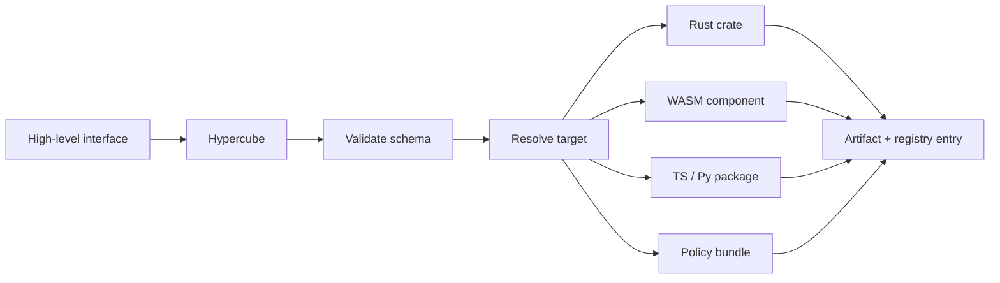

# Package translator — Hypercube (planned)

Hypercube is the language-agnostic high-level-to-low-level package interface (`hqb`). It
turns higher-level workflow logic, rules, policies, profiles, and patterns into lower-level
packages, artifacts, adapters, and runtime contracts.

It is the "higher-dimensional package manager" because it packages more than code. Status:
**planned** — this guide is the design target.

## What it packages

```txt
source code · Rust crates · WASM components · TypeScript/Python packages
configs · schemas · policies · profiles · workflow definitions
agent instructions · asset maps · runtime adapters · deployment metadata
```

## Responsibilities

Owns: package definitions and metadata, interface compilation, artifact packaging,
cross-language package mapping, policy/profile/adapter packaging, WASM/WASI package patterns.

Does **not** own: runtime command orchestration, terminal sessions, machine setup, shell
execution, tool detection, or session logs — those belong to [Kraken](runtime-controller.md).

## Workflow



## Package types

```txt
code-package        wraps source code or reusable libraries
pattern-package     a reusable architecture or workflow pattern
policy-package      rules, constraints, enforcement metadata
profile-package     a user/workspace/domain profile bundle
agent-package       prompts, skills, scopes, rails, gates
asset-package       a reusable asset bundle with provenance
component-package   a WASM/WASI component package
adapter-package     a toolchain or package-manager adapter
deployment-package  deployment/infrastructure targets (future)
```

## Relationship to native package managers

Hypercube does not replace native package managers — it compiles, wraps, links, validates,
and describes packages across systems. A TypeScript target is still installed by
pnpm/bun/npm; a Rust crate is still built by Cargo; a WASM component is still run by
[Ether](portable-runtime.md)/Wasmtime. Hypercube packages the system meaning; native tools execute
native responsibilities.

## Command surface

```bash
hqb init        hqb inspect <pkg>    hqb pack <pkg>
hqb compile     hqb publish local    hqb install <pkg>    hqb link
```

[Kraken](runtime-controller.md) may invoke `hqb` during routing; `hqb` is the daily CLI for package and
interface operations. Package contracts live in [Archon](metadata-plane.md).
