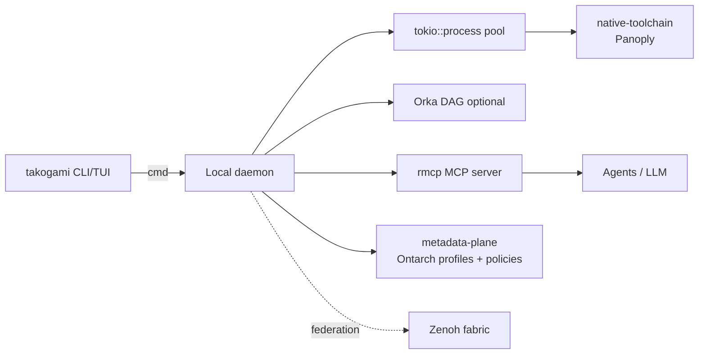

# Runtime architecture

This is the engine blueprint that sits under the
[runtime controller (Takogami)](runtime-controller.md): a high-performance, terminal-first
orchestrator driven by a unified CLI/TUI. It proxies native utilities, coordinates asynchronous
data across simultaneous workstreams, isolates distinct tenant/brand execution profiles, and
integrates AI augmentation natively.

It is a target architecture. The first useful version is a single-process CLI; the pieces
below describe how that scales without a rewrite.

## Client-daemon model

To stay responsive under dense workloads, WfOS avoids a single monolithic binary. The
terminal binary is a lightweight invocation client; resource allocation, process isolation,
data multiplexing, and AI state live in a long-running local daemon.



Evolution phases:

```txt
v0   single-process CLI — clap commands, direct tokio::process calls
v1   daemon-backed       — client talks to a local daemon over a Unix socket
v2   multi-panel TUI     — Ratatui views over the same daemon
```

## The Rust stack

Rather than a broad web framework that hides system access, the engine is built on
systems-level primitives, each mapped to a WfOS responsibility.

| Crate / spec | Role in WfOS | Maps to |
|--------------|--------------|---------|
| [Tokio](https://crates.io/crates/tokio) | Async event loop; non-blocking execution and signals | engine core |
| [`tokio::process`](https://docs.rs/tokio/latest/tokio/process/) | Spawn native tools as async children; stream stdout/stderr without UI lag | native-toolchain proxying |
| [starbase](https://crates.io/crates/starbase) | Application shell — lifecycle, sessions, diagnostics, reactive systems | runtime-controller (`takogami`) |
| [clap](https://crates.io/crates/clap) | Type-safe argument and command parsing inside the starbase app | runtime-controller commands |
| [Ratatui](https://crates.io/crates/ratatui) | Immediate-mode multi-panel terminal UI | TUI phase |
| [Serde](https://crates.io/crates/serde) | Parse profiles, brand maps, and pipeline configs | metadata-plane configs |
| [Orka](https://crates.io/crates/orka) | Pluggable async DAG workflow engine (candidate) | task orchestration |
| [Zenoh](https://crates.io/crates/zenoh) | Zero-overhead pub/sub data fabric | federation / multi-process |
| [`rmcp`](https://crates.io/crates/rmcp) + [MCP](https://modelcontextprotocol.io) | Expose native commands as standardized LLM tools | AI augmentation |

### Notes that keep it honest

- **starbase and clap are not alternatives.** starbase is the application shell (app
  lifecycle, sessions, diagnostics); clap is the parser it builds on. The runtime controller
  (Takogami) is a starbase app with clap-derived commands.
- **Config is TOML-first.** [Metadata-plane (Ontarch)](metadata-plane.md) descriptors, policies,
  and the tool manifest are TOML; the registry is JSON. Serde reads all of them — keep TOML as
  the default and reach for JSON/YAML only where a format is already imposed.
- **Orka is a candidate, not a commitment.** It is young. v0 can sequence tasks directly or
  lean on the [moon](monorepo.md) task graph; `petgraph`/`daggy` are simpler fallbacks if a
  dependency-light DAG is all that is needed.
- **Zenoh is for crossing boundaries.** On a single machine, local IPC is a Unix domain
  socket plus Tokio channels (or the `interprocess` crate). Zenoh earns its place when work
  spans processes or machines — it is the federation fabric, not the first-day default.
- **MCP is gated.** The daemon can embed an MCP server that exposes native-toolchain commands as
  tools, but every tool call is checked against metadata-plane agent policy (see
  [agent-rails.md](agent-rails.md)). Skills are scanned with SkillSpector before they are
  trusted.

## Multi-tenant / brand isolation

A single operator works across brands, domains, and clients. Isolation starts at the child
process boundary — the daemon injects the active profile's context (tenant, brand, scoped
env) when it spawns a tool. Stronger isolation (capability-scoped WASM via the
[portable-component runtime (Wisp)](portable-component-runtime.md), OS sandboxing) layers on later.
The classification of what data may cross which boundary is
[metadata-plane (Ontarch)](metadata-plane.md) stream policy (`private … federated`), and
promotion scope is the abstract Leader policy — neither is a folder.

## Core engine prototype

A minimal sketch of the structural mechanic: isolate a profile, launch a native tool, and
stream its output without blocking. An AI interception hook fits naturally on the stream.

```rust
use std::process::Stdio;
use tokio::io::{AsyncBufReadExt, BufReader};
use tokio::process::Command;

/// Active profile/brand context applied at the process boundary.
struct WorkstreamContext {
    tenant_id: String,
    brand_domain: String,
    target_tool: String,
    args: Vec<String>,
}

async fn execute_proxied_workflow(
    ctx: WorkstreamContext,
) -> Result<(), Box<dyn std::error::Error>> {
    // Enforce the profile's environment on the child process.
    let mut child = Command::new(&ctx.target_tool)
        .args(&ctx.args)
        .env("WFOS_TENANT", &ctx.tenant_id)
        .env("WFOS_BRAND", &ctx.brand_domain)
        .stdout(Stdio::piped())
        .stderr(Stdio::piped())
        .spawn()?;

    let stdout = child.stdout.take().ok_or("failed to capture stdout")?;
    let mut lines = BufReader::new(stdout).lines();

    // Stream output back into the active session, non-blocking.
    while let Some(line) = lines.next_line().await? {
        println!("[{}] {}", ctx.tenant_id, line);
        // AI interception hook fits here, e.g.:
        // if line.contains("error") { trigger_remediation(&line).await?; }
    }

    let status = child.wait().await?;
    println!("workflow finished: {status}");
    Ok(())
}
```

## Resource index

```txt
Tokio                 https://crates.io/crates/tokio
tokio::process        https://docs.rs/tokio/latest/tokio/process/
starbase              https://crates.io/crates/starbase
clap                  https://crates.io/crates/clap
Ratatui               https://crates.io/crates/ratatui
Serde                 https://crates.io/crates/serde
Orka                  https://crates.io/crates/orka
Zenoh                 https://crates.io/crates/zenoh
MCP (spec)            https://modelcontextprotocol.io
rmcp (Rust SDK)       https://crates.io/crates/rmcp
```

See [runtime-controller.md](runtime-controller.md) for the command surface and [monorepo.md](monorepo.md) for how
the engine crate slots into the workspace build.
