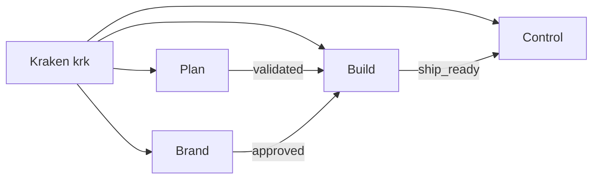
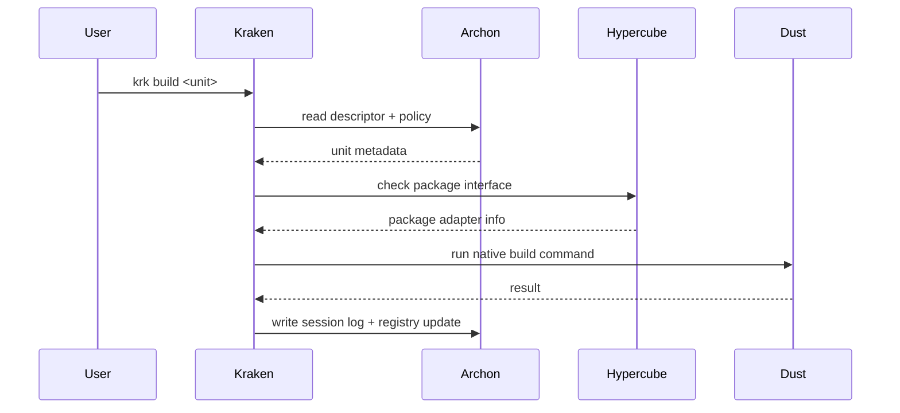

# Runtime controller — Kraken (planned)

Kraken is the runtime CLI and low-level control interface (`krk`). It is the daily command
surface that reaches into many tools, libraries, sessions, descriptors, policies, and agents.
It is **not** the package manager (that is [Hypercube](package-translator.md)) and **not** the tools
themselves (that is [Dust](native-substrate.md)) — it discovers, routes, and coordinates.

Status: **planned.** This guide is the design target; the package starts as a stub.

## Responsibilities

```txt
Discover local resources.      Read Archon.            Route commands.
Prepare environments.          Call native tools.     Run WASM components.
Manage sessions.               Apply rails and gates.  Expose system context.
```

## Command surface

```txt
krk scan         discover local resources
krk list         list units, tools, packages, or sessions
krk info <unit>  show resolved metadata for a unit
krk doctor       validate local machine readiness
krk dev|build|check <unit>   route common workflow commands
krk session      manage local work sessions and logs
krk tools        detect and report local tools
krk interfaces   validate descriptors, schemas, policies, registry entries
krk ether <c>    run or inspect portable WASM/WASI components
krk agent        run scoped agent rails and workflows
hqb …            hand off to the package translator
```

Every command should be explainable: `krk <cmd> --explain` prints the unit, the descriptor
and native manifest it resolved, the runtime/package adapter, the native command, the session
id, and the policies applied.

## Workstreams routing

Kraken routes into the four Workstreams namespaces (design target):

```txt
krk plan …       Plan — Decisions (briefs, specs, strategy)
krk brand …      Brand — Expressions (design, content)
krk build …      Build — Implementations (code, wfos, ds)
krk control …    Control — Operations (records, sync)
krk spec …       Plan filter (kind: spec)
krk qa …         Build QA gateway
krk release …    Build + Control when enabled
```



Canon: [architecture.md#workstreams-collection](architecture.md#workstreams-collection)

## Routing flow



## CLI foundation

Kraken is built on the Rust stack described in [runtime-architecture.md](runtime-architecture.md):

- **[starbase](https://crates.io/crates/starbase)** as the application shell (lifecycle,
  sessions, diagnostics, reactive systems), with **[clap](https://crates.io/crates/clap)** for
  command and argument parsing. starbase is the same foundation the workspace's build tooling
  is built on, so the patterns are shared.
- **[Tokio](https://crates.io/crates/tokio)** + `tokio::process` for non-blocking native tool
  proxying.
- **[Ratatui](https://crates.io/crates/ratatui)** for the later multi-panel TUI.

It routes to the [moon](monorepo.md) task graph as a compat backend and to [Dust](native-substrate.md)
for native execution. The v0 build is a single-process CLI; the daemon and TUI phases follow
(see [runtime-architecture.md](runtime-architecture.md#client-daemon-model)).

## AI augmentation

Kraken is designed for AI augmentation but does not require it. The daemon can embed an MCP
server (via [`rmcp`](https://crates.io/crates/rmcp)) that exposes commands as gated LLM tools;
every call is checked against Archon policy. Planned assists: command explanation, risk
detection, workflow suggestions, policy-aware planning, and session summaries. AI assists
Kraken; it does not silently control it. See [agent-rails.md](agent-rails.md).

## First prototype scope

```txt
scan · list · info · doctor · dev · build · check
session logs · descriptor read · registry write
hand-off to a Hypercube package descriptor and an Ether hello component
agent hard-block by default (read-only scope)
```
