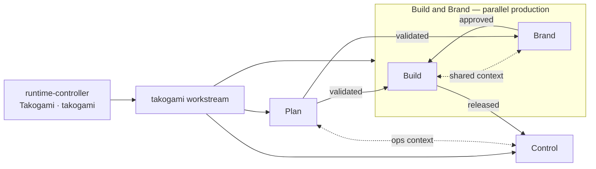
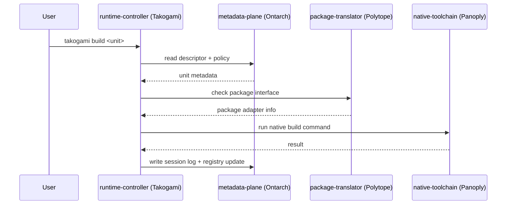

# Runtime controller — Takogami 🐙

The `runtime-controller` (Takogami) is the runtime CLI and low-level control interface (`takogami`).
It is the daily command surface that reaches into many tools, libraries, sessions, descriptors,
policies, and agents. It is **not** the package manager (that is the
[package translator (Polytope)](package-translator.md)) and **not** the tools themselves (that is
the [native toolchain (Panoply)](native-toolchain.md)) — it discovers, routes, and coordinates.

Status: **in progress.** The crate ships with the MVP command tree; only `doctor` is
implemented today, and other commands return structured `not_implemented`. Metadata and
runtime contracts (descriptor, schemas, Ontarch projection, Rust types) are in place.
Discovery, routing, policy execution, and operational sessions are still ahead. See
[`packages/takogami/README.md`](../packages/takogami/README.md) for the proved surface;
build position lives in `Build/bin/wfos/STATE.md` and `SESSIONS.md`.

## Responsibilities

```txt
Discover local resources.      Read metadata plane.     Route commands.
Prepare environments.          Call native tools.     Run WASM components.
Manage sessions.               Apply rails and gates.  Expose system context.
```

## Command surface

```txt
takogami scan         discover local resources
takogami list         list units, tools, packages, or sessions
takogami info <unit>  show resolved metadata for a unit
takogami doctor       validate local machine readiness
takogami dev|build|check <unit>   route common workflow commands
takogami session      manage local work sessions and logs
takogami tools        detect and report local tools
takogami interfaces   validate descriptors, schemas, policies, registry entries
takogami portable <c> run or inspect portable WASM/WASI components (portable-component-runtime / Wisp)
takogami native <c>   inspect and execute host-native tooling (native-toolchain / Panoply)
takogami meta <c>     validate, graph, and query system metadata (metadata-plane / Ontarch)
takogami package …    hand off to the package translator (Polytope)
takogami workstream …   profile-agnostic Workstreams / gateway routing
takogami tendril <c>  list, inspect, attach, and invoke runtime integrations
takogami agent        run scoped agent rails and workflows
```

Runtime integrations are runtime-controller-internal units (archetype `runtime-integration`, brand
vocabulary **Tendril**) living under the package's `src/integrations/` namespace — there is no
separate integration package. See the Level 0 namespace alignment for the contract and
substructure (`registry/`, `contracts/`, `adapters/`, `connectors/`, `bindings/`, `providers/`).

Every command should be explainable: `takogami <cmd> --explain` prints the unit, the descriptor
and native manifest it resolved, the runtime/package adapter, the native command, the session
id, and the policies applied.

## Workstream routing

The runtime controller routes into Workstreams namespaces and gateway metadata through a
universal `takogami workstream` surface. Profile shortcuts (`takogami plan`, `takogami brand`, `takogami control`,
plus `spec` / `qa` / `release` / `agent`) alias into it. Top-level `takogami build|dev|check` remain
unit-lifecycle verbs — Build-namespace entry is `takogami workstream build`, not `takogami build`.

```txt
# Universal (preferred)
takogami workstream plan …       Plan — Decisions (briefs, specs, strategy)
takogami workstream brand …      Brand — Expressions (design, content)
takogami workstream build …      Build — Implementations (code, wfos, ds)
takogami workstream control …    Control — Operations (records, sync)

# Workstreams profile aliases
takogami plan …                → takogami workstream plan …
takogami brand …               → takogami workstream brand …
takogami control …             → takogami workstream control …
takogami spec …                Plan filter (kind: spec)
takogami qa …                  Build QA gateway
takogami release …             Build + Control when enabled

# Unit lifecycle (not namespace routing)
takogami build|dev|check <unit>
```



Canon: [architecture.md#workstreams-collection](architecture.md#workstreams-collection). Shape:
`Plan ←[gates]→ | Build ←→ Brand | ←[gates]→ Control`.

## Routing flow



## CLI foundation

The runtime controller is built on the Rust stack described in
[runtime-architecture.md](runtime-architecture.md):

- **[starbase](https://crates.io/crates/starbase)** as the application shell (lifecycle,
  sessions, diagnostics, reactive systems), with **[clap](https://crates.io/crates/clap)** for
  command and argument parsing. starbase is the same foundation the workspace's build tooling
  is built on, so the patterns are shared.
- **[Tokio](https://crates.io/crates/tokio)** + `tokio::process` for non-blocking native tool
  proxying.
- **[Ratatui](https://crates.io/crates/ratatui)** for the later multi-panel TUI.

It routes to the [moon](monorepo.md) task graph as a compat backend and to the
[native toolchain (Panoply)](native-toolchain.md) for native execution. The v0 build is a
single-process CLI; the daemon and TUI phases follow (see
[runtime-architecture.md](runtime-architecture.md#client-daemon-model)).

## AI augmentation

The runtime controller is designed for AI augmentation but does not require it. The daemon can
embed an MCP server (via [`rmcp`](https://crates.io/crates/rmcp)) that exposes commands as gated
LLM tools; every call is checked against metadata-plane policy. Planned assists: command
explanation, risk detection, workflow suggestions, policy-aware planning, and session summaries.
AI assists the runtime controller; it does not silently control it. See
[agent-rails.md](agent-rails.md).

## First prototype scope

```txt
scan · list · info · doctor · dev · build · check
session logs · descriptor read · registry write
hand-off to a package-translator descriptor and a portable-component-runtime hello component
agent hard-block by default (read-only scope)
```
