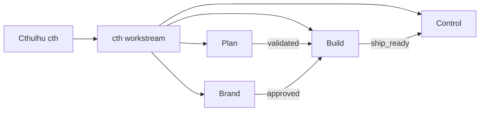
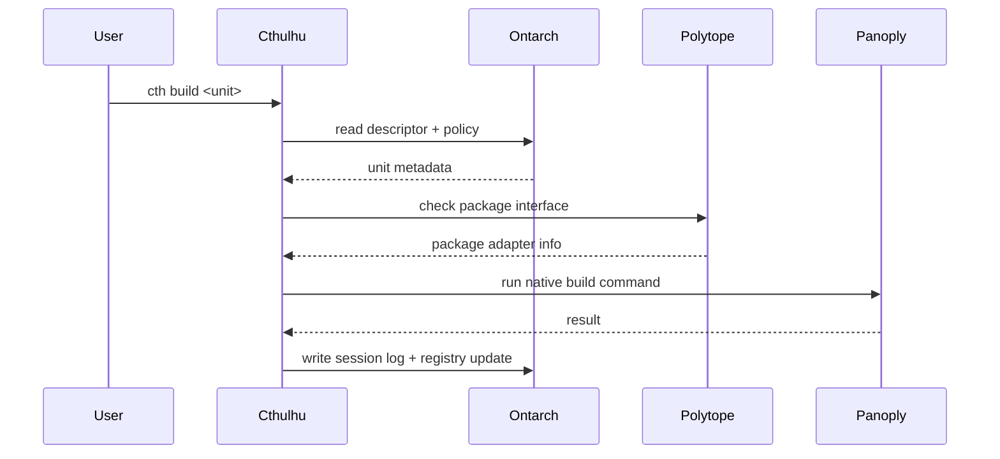

# Runtime controller — Cthulhu (planned)

Cthulhu is the runtime CLI and low-level control interface (`cth`). It is the daily command
surface that reaches into many tools, libraries, sessions, descriptors, policies, and agents.
It is **not** the package manager (that is [Polytope](package-translator.md)) and **not** the tools
themselves (that is [Panoply](native-toolchain.md)) — it discovers, routes, and coordinates.

Status: **planned.** This guide is the design target; the package starts as a stub.

## Responsibilities

```txt
Discover local resources.      Read Ontarch.            Route commands.
Prepare environments.          Call native tools.     Run WASM components.
Manage sessions.               Apply rails and gates.  Expose system context.
```

## Command surface

```txt
cth scan         discover local resources
cth list         list units, tools, packages, or sessions
cth info <unit>  show resolved metadata for a unit
cth doctor       validate local machine readiness
cth dev|build|check <unit>   route common workflow commands
cth session      manage local work sessions and logs
cth tools        detect and report local tools
cth interfaces   validate descriptors, schemas, policies, registry entries
cth portable <c> run or inspect portable WASM/WASI components (Wisp)
cth native <c>   inspect and execute host-native tooling (Panoply)
cth meta <c>     validate, graph, and query system metadata (Ontarch)
cth package …    hand off to the package translator (Polytope)
cth workstream …   profile-agnostic Workstreams / gateway routing
cth tendril <c>  list, inspect, attach, and invoke runtime integrations
cth agent        run scoped agent rails and workflows
```

Runtime integrations are Cthulhu-internal units (archetype `runtime-integration`, brand
vocabulary **Tendril**) living under the package's `src/integrations/` namespace — there is no
separate integration package. See the Level 0 namespace alignment for the contract and
substructure (`registry/`, `contracts/`, `adapters/`, `connectors/`, `bindings/`, `providers/`).

Every command should be explainable: `cth <cmd> --explain` prints the unit, the descriptor
and native manifest it resolved, the runtime/package adapter, the native command, the session
id, and the policies applied.

## Workstream routing

Cthulhu routes into Workstreams namespaces and gateway metadata through a universal
`cth workstream` surface. Profile shortcuts (`cth plan`, `cth brand`, `cth control`, plus
`spec` / `qa` / `release` / `agent`) alias into it. Top-level `cth build|dev|check` remain
unit-lifecycle verbs — Build-namespace entry is `cth workstream build`, not `cth build`.

```txt
# Universal (preferred)
cth workstream plan …       Plan — Decisions (briefs, specs, strategy)
cth workstream brand …      Brand — Expressions (design, content)
cth workstream build …      Build — Implementations (code, wfos, ds)
cth workstream control …    Control — Operations (records, sync)

# Workstreams profile aliases
cth plan …                → cth workstream plan …
cth brand …               → cth workstream brand …
cth control …             → cth workstream control …
cth spec …                Plan filter (kind: spec)
cth qa …                  Build QA gateway
cth release …             Build + Control when enabled

# Unit lifecycle (not namespace routing)
cth build|dev|check <unit>
```



Canon: [architecture.md#workstreams-collection](architecture.md#workstreams-collection)

## Routing flow



## CLI foundation

Cthulhu is built on the Rust stack described in [runtime-architecture.md](runtime-architecture.md):

- **[starbase](https://crates.io/crates/starbase)** as the application shell (lifecycle,
  sessions, diagnostics, reactive systems), with **[clap](https://crates.io/crates/clap)** for
  command and argument parsing. starbase is the same foundation the workspace's build tooling
  is built on, so the patterns are shared.
- **[Tokio](https://crates.io/crates/tokio)** + `tokio::process` for non-blocking native tool
  proxying.
- **[Ratatui](https://crates.io/crates/ratatui)** for the later multi-panel TUI.

It routes to the [moon](monorepo.md) task graph as a compat backend and to [Panoply](native-toolchain.md)
for native execution. The v0 build is a single-process CLI; the daemon and TUI phases follow
(see [runtime-architecture.md](runtime-architecture.md#client-daemon-model)).

## AI augmentation

Cthulhu is designed for AI augmentation but does not require it. The daemon can embed an MCP
server (via [`rmcp`](https://crates.io/crates/rmcp)) that exposes commands as gated LLM tools;
every call is checked against Ontarch policy. Planned assists: command explanation, risk
detection, workflow suggestions, policy-aware planning, and session summaries. AI assists
Cthulhu; it does not silently control it. See [agent-rails.md](agent-rails.md).

## First prototype scope

```txt
scan · list · info · doctor · dev · build · check
session logs · descriptor read · registry write
hand-off to a Polytope package descriptor and a Wisp hello component
agent hard-block by default (read-only scope)
```
