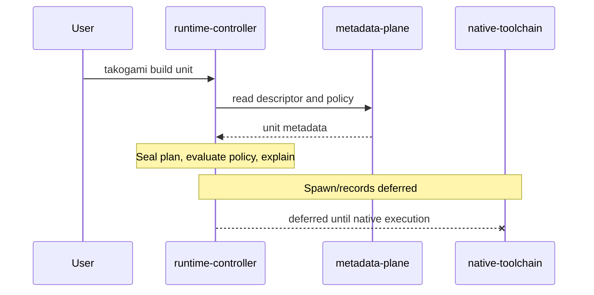

# Runtime controller — Takogami 🐙

The `runtime-controller` (Takogami) is the runtime CLI and low-level control interface (`takogami`).
It is the daily command surface that reaches into many tools, libraries, descriptors,
policies, and agents. It is **not** the package manager (that is the
[package translator (Polytope)](package-translator.md)) and **not** the tools themselves (that is
the [native toolchain (Panoply)](native-toolchain.md)) — it discovers, routes, and coordinates.

It does **not** own persistent terminal PTYs, desktop window restore, or messaging channels.
Those belong to optional providers (tmux / Herdr for terminals; Hammerspoon and others for
desktop layout; an external gateway such as Push for message/schedule ingress). See
[native-toolchain.md](native-toolchain.md).

Status: **in progress; policy enforcement complete (still plan-only for child processes).**
Discovery, list/info/tools/interfaces, doctor, the command-record contract, deterministic
lifecycle resolution/`--explain`, and dual-layer profile/policy evaluation are implemented.
Allowed `--execute` reaches only an unavailable executor seam (`execution_unavailable`). Process
execution and persisted **command execution records** remain ahead. See
[`packages/takogami/README.md`](../packages/takogami/README.md) for the proved surface;
implementation provenance lives in [`packages/ontarch/registry/sessions/`](../packages/ontarch/registry/sessions/).

## Responsibilities

```txt
Discover local resources.      Read metadata plane.     Route commands.
Prepare environments.          Call native tools.     Run WASM components (later).
Record command attempts.       Apply rails and gates.  Expose system context.
Coordinate providers.          Do not own PTY servers. Do not snapshot desktops in the runtime MVP.
```

## Command surface

### Runtime MVP (authoritative for M4)

```txt
takogami scan         discover local resources
takogami list         list units or tools (not sessions)
takogami info <unit>  show resolved metadata for a unit
takogami doctor       validate local machine readiness
takogami tools        report tools from Panoply / Ontarch projections
takogami interfaces   validate descriptors, schemas, policies, registry entries
takogami dev|build|check <unit> [--explain] [--execute]   resolve + policy (plan-only)
takogami graph        project metadata-plane graph
takogami bin report|cleanup   project bin/archive contracts
takogami session list|show|latest   read command execution records (not work sessions)
```

Lifecycle verbs resolve a sealed plan, then evaluate dual-layer policy (Takogami request +
child intent) with Deny > Gate > Allow. `--explain` prints resolution and policy provenance;
resolution failures print the safely completed portion without a digest. Gate fails closed (no
CLI/env/file approval bypass). Allowed `--execute` returns `execution_unavailable` until native
execution is implemented. Profile precedence is CLI `--profile` → `TAKOGAMI_PROFILE` →
`workspace-dev` → fail closed. Policy does not claim an OS sandbox after spawn.

`takogami session *` is the future operational **command-record** query surface. It does not
start/stop composed work sessions. Replaying a record does not restore a terminal pane or
window layout.

### Post-MVP (aspirational — not part of the runtime MVP)

```txt
takogami portable <c>   portable WASM/WASI components (Wisp)
takogami native <c>     host-native tooling inspection (beyond tools/doctor)
takogami meta <c>       metadata-plane operator surface
takogami package …      package translator (Polytope)
takogami workstream …   Workstreams / gateway routing
takogami integrate <c>  runtime integrations (archetype runtime-integration; deferred)
takogami agent          scoped agent rails / agent-interface (brand pending)
takogami work-session … composed multi-provider restore (post-MVP)
```

Optional `integrations/` modules under the runtime-controller package are an implementation
layout for `runtime-integration` units — not a separate product. Unadopted brand candidates do
not belong in package names or the live command surface.

Every MVP command should be explainable: `takogami <cmd> --explain` prints the unit, the
descriptor and native manifest it resolved, the runtime/package adapter, the native command,
the correlation/session id, and the policies applied.

## Workstream routing (post-MVP)

The runtime controller will route into Workstreams namespaces through a universal
`takogami workstream` surface. Profile shortcuts and gateway aliases are post-MVP. Top-level
`takogami build|dev|check` remain unit-lifecycle verbs — Build-namespace entry will be
`takogami workstream build`, not `takogami build`.

Canon: [architecture.md#workstreams-collection](architecture.md#workstreams-collection). Shape:
`Plan ←[gates]→ | Build ←→ Brand | ←[gates]→ Control`.

## Routing flow (MVP)



The current phase stops after policy: dual-layer Allow/Gate/Deny is enforced, but child
processes and command records are not yet started. Registry write-back after every routed
command is **not** runtime MVP; Ontarch remains the registry owner.

## Composition boundary

| Layer | Owner |
|-------|--------|
| Resolve / policy / direct spawn / command records | Takogami |
| Tool install and detection | Panoply |
| Lightweight terminal persistence | tmux (default) |
| Rich agent workspaces | Herdr (optional additive; not required for doctor) |
| Desktop window geometry | Desktop providers (post-MVP) |
| Message/schedule ingress to an existing agent | Push or another narrow gateway (optional; post-MVP) |

A gateway authenticates who may ask an agent to act; it does not authorize the resulting WfOS
operation. The spawned agent must use the same profile-bound CLI/MCP surface as a local caller.
Remote messages cannot satisfy Gate or override Deny. Push's unattended job mode remains outside
the supported path until policy-bound execution and constrained automation are proved.

## CLI foundation

The runtime controller is built on the Rust stack described in
[runtime-architecture.md](runtime-architecture.md):

- **[starbase](https://crates.io/crates/starbase)** as the application shell, with
  **[clap](https://crates.io/crates/clap)** for command and argument parsing.
- **[Tokio](https://crates.io/crates/tokio)** + `tokio::process` for non-blocking native tool
  proxying.
- A later TUI (e.g. Ratatui), if any, is for cross-provider operator UX — **not** a clone of
  Herdr's multiplexer UI. Persistent terminals stay with Herdr/tmux.

The v0 build is a single-process CLI. Any future daemon must be justified by cross-provider
scheduling, event correlation, or policy enforcement — not by owning a terminal server. See
[runtime-architecture.md](runtime-architecture.md#client-daemon-model).

## AI augmentation

The runtime controller is designed for AI augmentation but does not require it. A later daemon
may embed an MCP server that exposes commands as gated LLM tools; every call is checked against
metadata-plane policy. See [agent-rails.md](agent-rails.md).

## First prototype scope (M4)

```txt
scan · list units|tools · info · doctor · tools · interfaces
dev · build · check · graph · bin report|cleanup
command execution records via session list|show|latest
agent hard-block by default (read-only / fail-closed policy)
```
