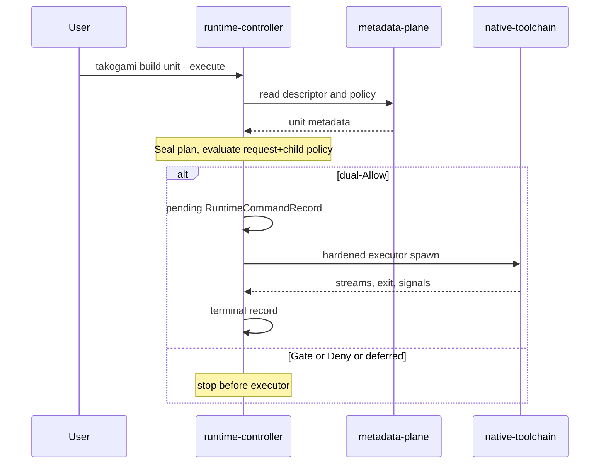

# Runtime controller — Takogami 🐙

The `runtime-controller` (Takogami) is the runtime CLI and low-level control interface (`takogami`).
It is the daily command surface that reaches into many tools, libraries, descriptors,
policies, and agents. It is **not** the package manager (that is the
[package translator (Polytope)](package-translator.md)) and **not** the tools themselves (that is
the [native toolchain (Panoply)](native-toolchain.md)) — it discovers, routes, and coordinates.

It does **not** own persistent terminal PTYs, desktop window restore, or messaging channels.
Those belong to optional providers (tmux / Herdr for terminals; Hammerspoon and others for
desktop layout; an external gateway such as Push for message/schedule ingress). See
[native-toolchain.md](native-toolchain.md).

Status: **E09 runtime-controller MVP implemented (pending release closeout).** Discovery,
list/info/tools/interfaces, doctor, dual-layer policy, sealed-plan resolution, direct
`--execute` through one hardened Tokio executor, `session list|show|latest`, `takogami graph`,
and supported `takogami bin` projections are in place. Lifecycle resolution is plan-only unless
`--execute` is supplied. Only evaluator-minted dual-Allow authorization reaches execution.
Gate/Deny/deferred paths never spawn. Graph is a separate zero-spawn/no-record path with no
implicit sync. Optional RTK postprocesses bounded human streams only. Interactive providers and
work-session restore remain post-MVP. See [`packages/takogami/README.md`](../packages/takogami/README.md);
provenance lives in [`packages/ontarch/registry/sessions/`](../packages/ontarch/registry/sessions/).

## Responsibilities

```txt
Discover local resources.      Read metadata plane.     Route commands.
Prepare environments.          Call native tools.     Run WASM components (later).
Record command attempts.       Apply rails and gates.  Expose system context.
Coordinate providers.          Do not own PTY servers. Do not snapshot desktops in the runtime MVP.
```

## Command surface

### Runtime MVP (authoritative for M4)

```txt
takogami scan         discover local resources
takogami list         list units or tools (not sessions)
takogami info <unit>  show resolved metadata for a unit
takogami doctor       validate local machine readiness
takogami tools        report tools from Panoply / Ontarch projections
takogami interfaces   validate descriptors, schemas, policies, registry entries
takogami dev|build|check <unit> [--explain] [--execute]   resolve + policy + optional direct execute
takogami graph        project metadata-plane graph (read-only; see Graph projection)
takogami bin report|cleanup   project bin/archive contracts (sealed helper PATH; dual-Allow)
takogami session list|show|latest   read command execution records (not work sessions)
```

### Graph projection

`takogami graph` loads `registry/graph.json` with no-follow, bounded reads and layered
freshness. Upstream fingerprints use Ontarch `registry_root`; authored unit fingerprints use
`workspace_root`. Formats: `text` (default), `dot`, `json`. Global `--json` emits one envelope.

Hit / miss / stale never trigger an implicit sync. On miss or stale, run
`moon run ontarch:sync` (or `ontarch sync`) explicitly, then re-query. Graph queries spawn no
child and write no operational command record. Sibling `graph.dot` is not trusted. Graph machine
JSON is never RTK transformed.

### Bin projection

`takogami bin report|cleanup` seals a controller-owned Ontarch identity and helper PATH.
Caller `PATH` has no authority. Projection children receive controller-owned `PANOPLY_AGENT=1`.

| Operation | Request/child decision | Ontarch child | Record outcome |
|-----------|------------------------|---------------|----------------|
| `bin report` | Allow / Allow | executes once | completed / controller error / failure as truthful |
| cleanup `report-only` | Allow / Allow | executes once | completed / controller error / failure as truthful |
| cleanup `dry-run` | Gate | no spawn | gated |
| cleanup `archive` | Deny + `deferred_unavailable` | no spawn | denied |
| cleanup `delete-approved` | Deny + `deferred_unavailable` | no spawn | denied |

Explicit `--scope` requires `namespace/bin/<segment>[/<segment>...]`. Omitting `--scope` keeps
workspace-wide non-mutating report/planning behavior. Bin machine JSON is never RTK transformed;
full inventory/plan payloads are not persisted in command records. Archive/delete mutation is
not available in E09.

Helper trust model:

- caller `PATH` has no authority;
- helper search directories are a closed controller-owned list;
- world-writable directories and helper targets are rejected;
- developer-managed directories such as Homebrew or `/usr/local` may be accepted when not
  world-writable;
- exact helper lookup path, canonical target, and content digest are sealed;
- PATH first-match selection is verified before spawn;
- same-user mutation after the final preflight is not claimed to be atomically impossible;
- no root-owned or package-manager provenance claim is made.

### Lifecycle and policy

Lifecycle verbs resolve a sealed plan, then evaluate dual-layer policy (Takogami request +
child intent) with Deny > Gate > Allow. Resolution is plan-only unless `--execute` is
supplied. `--explain` prints resolution and policy provenance; resolution failures print the
safely completed portion without a digest. Gate fails closed (no CLI/env/file approval bypass).
Allowed direct `--execute` persists a pending `RuntimeCommandRecord` (schema `0.1.0`), then
spawns the sealed executable through the single hardened Tokio executor (no shell, no PATH
re-search). Interactive classes still return `execution_class_unavailable`. Profile precedence
is CLI `--profile` → `TAKOGAMI_PROFILE` → `workspace-dev` → fail closed. Policy does not claim
an OS sandbox after spawn.

Child authorization requires an explicit matching command Allow. An allowed cwd, manifest, or
operand path only satisfies path scope; it never grants command authority. Unknown command forms
therefore remain default Deny even when every referenced path is inside the workspace. Gate,
Deny, and policy-contract output uses a safe plan summary and omits raw rejected argv, secret
identifiers, executable paths, cwd, manifests, and outside-workspace operands.

`takogami session list|show|latest` queries operational **command-execution** records under the
resolved state home. It does not start/stop composed work sessions. Showing a record does not
restore a terminal pane or window layout.

### Post-MVP (aspirational — not part of the runtime MVP)

```txt
takogami portable <c>   portable WASM/WASI components (Wisp)
takogami native <c>     host-native tooling inspection (beyond tools/doctor)
takogami meta <c>       metadata-plane operator surface
takogami package …      package translator (Polytope)
takogami workstream …   Workstreams / gateway routing
takogami integrate <c>  runtime integrations (archetype runtime-integration; deferred)
takogami agent          scoped agent rails / agent-interface (brand pending)
takogami work-session … composed multi-provider restore (post-MVP)
```

Optional `integrations/` modules under the runtime-controller package are an implementation
layout for `runtime-integration` units — not a separate product. Unadopted brand candidates do
not belong in package names or the live command surface.

Every MVP command should be explainable: `takogami <cmd> --explain` prints the unit, the
descriptor and native manifest it resolved, the runtime/package adapter, the native command,
the correlation/session id, and the policies applied.

## Workstream routing (post-MVP)

The runtime controller will route into Workstreams namespaces through a universal
`takogami workstream` surface. Profile shortcuts and gateway aliases are post-MVP. Top-level
`takogami build|dev|check` remain unit-lifecycle verbs — Build-namespace entry will be
`takogami workstream build`, not `takogami build`.

Canon: [architecture.md#workstreams-collection](architecture.md#workstreams-collection). Shape:
`Plan ←[gates]→ | Build ←→ Brand | ←[gates]→ Control`.

## Routing flow (MVP)


```mermaid
sequenceDiagram
  participant U as User
  participant K as runtime-controller
  participant C as metadata-plane
  participant D as native-toolchain
  U->>K: takogami build unit --execute
  K->>C: read descriptor and policy
  C-->>K: unit metadata
  Note over K: Seal plan, evaluate request+child policy
  alt dual-Allow
    K->>K: pending RuntimeCommandRecord
    K->>D: hardened executor spawn
    D-->>K: streams, exit, signals
    K->>K: terminal record
  else Gate or Deny or deferred
    Note over K: stop before executor
  end
```

Graph is a separate path: read `registry/graph.json`, validate freshness, project text/DOT/JSON,
and return — no child, no record, no implicit sync.

Lifecycle and supported bin projections share one hardened executor. Request and child policy
both evaluate. Only evaluator-minted dual-Allow authorization reaches execution. Pending →
PID-bearing pending → terminal transitions are recorded truthfully under schema `0.1.0`.
Registry write-back after every routed command is **not** runtime MVP; Ontarch remains the
registry owner. Pre-spawn revalidation seals Ontarch helper identity; projection children receive
controller-owned `PANOPLY_AGENT=1`.

Controller exit categories: `0` success, `1` internal, `2` usage, `3` contract, `4` resolution,
`5` policy deny, `6` policy gate, `7` state I/O, `8` execution I/O, `10` not implemented /
unavailable execution class.

## Composition boundary

| Layer | Owner |
|-------|--------|
| Resolve / policy / direct spawn / command records | Takogami |
| Tool install and detection | Panoply |
| Lightweight terminal persistence | tmux (default; optional) |
| Rich agent workspaces | Herdr (optional additive; not required for doctor) |
| Desktop window geometry | Desktop providers (post-MVP) |
| Message/schedule ingress to an existing agent | Push or another narrow gateway (optional; post-MVP) |

Optional providers are discovery/readiness inputs, not owned services. Takogami does not start
tmux or Herdr servers in E09. Missing Herdr is nonfatal unless a later profile explicitly
requires it.

A gateway authenticates who may ask an agent to act; it does not authorize the resulting WfOS
operation. The spawned agent must use the same profile-bound CLI/MCP surface as a local caller.
Remote messages cannot satisfy Gate or override Deny. Push's unattended job mode remains outside
the supported path until policy-bound execution and constrained automation are proved.

## CLI foundation

The runtime controller is built on the Rust stack described in
[runtime-architecture.md](runtime-architecture.md):

- **[starbase](https://crates.io/crates/starbase)** as the application shell, with
  **[clap](https://crates.io/crates/clap)** for command and argument parsing.
- **[Tokio](https://crates.io/crates/tokio)** + `tokio::process` for the single hardened
  native-execution path shared by lifecycle and supported bin projections.
- A later TUI (e.g. Ratatui), if any, is for cross-provider operator UX — **not** a clone of
  Herdr's multiplexer UI. Persistent terminals stay with Herdr/tmux.

The v0 build is a single-process CLI. Any future daemon must be justified by cross-provider
scheduling, event correlation, or policy enforcement — not by owning a terminal server. See
[runtime-architecture.md](runtime-architecture.md#client-daemon-model).

## AI augmentation

The runtime controller is designed for AI augmentation but does not require it. A later daemon
may embed an MCP server that exposes commands as gated LLM tools; every call is checked against
metadata-plane policy. See [agent-rails.md](agent-rails.md).

## First prototype scope (M4)

```txt
scan · list units|tools · info · doctor · tools · interfaces
dev · build · check · graph · bin report|cleanup
command execution records via session list|show|latest
agent hard-block by default (read-only / fail-closed policy)
```
