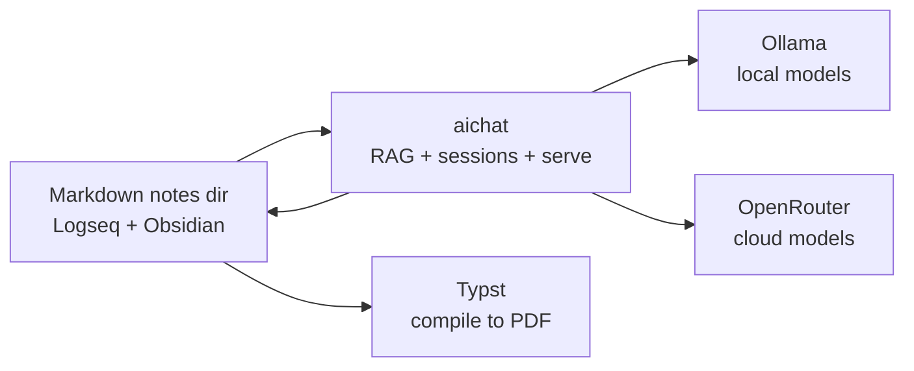
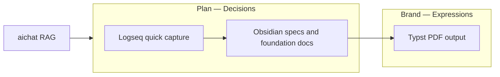

# Core workflow apps & tools

The essential native, local-first apps and tools WfOS recommends for low-level writing,
note-taking, and AI-assisted document workflows — and how they fit together. These are
**recommendations**, not dependencies: none are installed by `dust bootstrap`, and the
markdown-on-disk source of truth keeps every choice swappable.

The detailed product concept that builds on this stack (Mindflow) lives in
[Plan/bin/lg_wfos_prod_mindflow.md](../../../../../../Plan/bin/lg_wfos_prod_mindflow.md).
WfOS stays decoupled from it for now.

Status legend: **recommended** (the WfOS starting point) · **optional** (swappable
alternative) · **reference** (noted, not endorsed for new work).

---

## The stack at a glance

| Layer | Tool | Role |
|-------|------|------|
| Quick capture | [Logseq](https://logseq.com/) | fast notes, ideas, research, daily journaling |
| Long-form docs | [Obsidian](https://obsidian.md/) | larger docs, specs, structured vaults |
| Typeset / publish | [Typst](https://typst.app/) | compile markdown/Typst into polished PDFs |
| AI engine (local) | [aichat](https://github.com/sigoden/aichat) + [Ollama](https://ollama.com/) | RAG over notes, sessions, local models, no Docker |
| AI engine (cloud) | [OpenRouter](https://openrouter.ai/) | high-tier cloud models when local isn't enough |

Everything reads and writes **plain markdown in a directory you own** (git-tracked, readable
by agents, devs, and sessions). The editor and AI engine are layers on top of that directory,
not the source of truth.

---

## Writing & notes

### Logseq — quick notes, ideas, research (recommended)

[Logseq](https://logseq.com/) (AGPL-3.0) is an outliner for fast, low-friction capture: daily
journals, fleeting ideas, research snippets, and linked thoughts. Its block model and backlinks
make it ideal for the early "catch the idea before it's gone" stage. Files are local markdown.

### Obsidian — larger docs and specs (recommended)

[Obsidian](https://obsidian.md/) (proprietary, free for personal use) is the home for larger,
more structured work: specs, briefs, foundational docs, and long-form writing. Its mature plugin
ecosystem (including local-AI plugins) and vault model suit documents that graduate out of quick
capture. Vaults are plain markdown folders.

**How they pair:** capture in Logseq → promote anything worth developing into an Obsidian vault
where it becomes a doc/spec. Both sit over markdown, so the same files stay readable to the AI
engine and to agents.

### SilverBullet — OSS/hackable alternative (optional)

[SilverBullet](https://silverbullet.md/) (MIT) is a single-process, self-hosted markdown
workspace that is highly scriptable. Consider it if you want a fully open-source, extensible base
to build custom writing workflows on rather than a packaged app.

---

## Typeset & publish — Typst

[Typst](https://typst.app/open-source/) (Apache-2.0) compiles markup into publish-grade PDFs much
faster than LaTeX, with a modern scripting language. Use it as the final step that turns markdown
notes/specs into polished documents and whitepapers. The [tinymist](https://github.com/Myriad-Dreamin/tinymist)
language server adds editor integration (preview, completion) in VS Code/Neovim.

---

## AI engine — aichat + Ollama, with OpenRouter for cloud

[aichat](https://github.com/sigoden/aichat) (MIT/Apache-2.0) is a single Rust binary that turns a
notes directory into an AI workspace:

- **RAG** over your markdown directory (`aichat --rag <name>`),
- **sessions** and **roles** for context-aware, repeatable interactions,
- **function calling / MCP / agents** for tool use,
- a built-in local API (`aichat --serve`) any editor plugin or future UI can point at.

[Ollama](https://ollama.com/) (MIT) runs open models locally with no Docker required, keeping
notes private by default. [OpenRouter](https://openrouter.ai/) is configured as an additional
provider so you can route to high-tier cloud models when a task needs more than a local model can
give — same `aichat` interface, different backend.

> Privacy posture: local-first by default (Ollama); cloud is opt-in per request via the OpenRouter
> provider. Nothing leaves the machine unless you choose a cloud model.

---

## How they fit together



1. **Capture** ideas/research in Logseq; develop docs and specs in Obsidian — all plain markdown
   in one directory.
2. **Augment** with aichat: RAG and sessions read that directory; responses and structured
   outputs are written back as markdown.
3. **Route** to Ollama locally by default, or OpenRouter for high-tier cloud models when needed.
4. **Publish** finished specs/docs through Typst.

---

## Workstreams placement

Recommended namespace mapping for the writing stack:



- **Plan/bin/** — fleeting capture, scratch research (Logseq-oriented flow)
- **Plan/src/** — validated specs, foundation docs (Obsidian vault canon)
- **Brand/lib/** — published PDFs and export copies (Typst output)

---

## Quick start (not part of `dust bootstrap`)

These are documented installs you run manually — WfOS does not install or manage them.

```bash
# CLI tools (Homebrew)
brew install aichat ollama typst

# Apps (Homebrew casks)
brew install --cask obsidian logseq

# Pull a local model and start the daemon
ollama pull llama3.1          # or any model from https://ollama.com/library
ollama serve                  # background local model server

# Point aichat at a local model + index your notes for RAG
#   ~/.config/aichat/config.yaml — set the Ollama client and an OpenRouter client:
#     clients:
#       - type: openai-compatible
#         name: ollama
#         api_base: http://localhost:11434/v1
#       - type: openai-compatible
#         name: openrouter
#         api_base: https://openrouter.ai/api/v1
#         api_key: <OPENROUTER_API_KEY>
aichat --rag notes            # build/query a RAG over your notes directory
aichat --serve                # expose a local OpenAI-compatible API + playground
```

License notes: aichat (MIT/Apache-2.0), Ollama (MIT), Typst (Apache-2.0), Logseq (AGPL-3.0),
Obsidian (proprietary, free tier), SilverBullet (MIT), OpenRouter (hosted service).

---

## Sessions & workspace restoration

Restore where you left off — windows, tabs, apps, and terminal context — across a workflow.

| Tool | Idea | Status |
|------|------|--------|
| [FlashSpace](https://github.com/wojciech-kulik/FlashSpace) | fast virtual workspace/space switching (macOS) | optional |
| [Freeter](https://freeter.io/) | organize tools and resources per workflow | optional |
| Decks | bring scattered knowledge back together | reference |
| [Spaces](https://spacesformac.xyz/) | per-context window and app layouts | reference |
| [tmux](https://github.com/tmux/tmux) / [zellij](https://github.com/zellij-org/zellij) | persistent terminal sessions (Dust `session` module) | core |
| [Kilo Code](https://github.com/Kilo-Org/kilocode) | reference for context/session storage and knowledge transfer between sessions/agents | reference |

Terminal sessions are already part of the Dust [`session` module](native-substrate.md#modules); GUI
window/space restoration is handled by the apps above today and is a candidate for future Kraken
session management.

---

## Relationship to WfOS

- These apps are **documented recommendations**, not Dust-managed tools — install them yourself.
- The markdown directory is the contract; editors and AI engines are swappable layers over it.
- The deeper idea-capture → spec product concept (Mindflow) is intentionally decoupled and lives
  in the Plan/bin planning docs. WfOS may install it eventually, but is not coupled to it now.
- See [tool-catalog.md](tool-catalog.md) for the full grouped catalog and [native-substrate.md](native-substrate.md) for
  the native CLI substrate.
