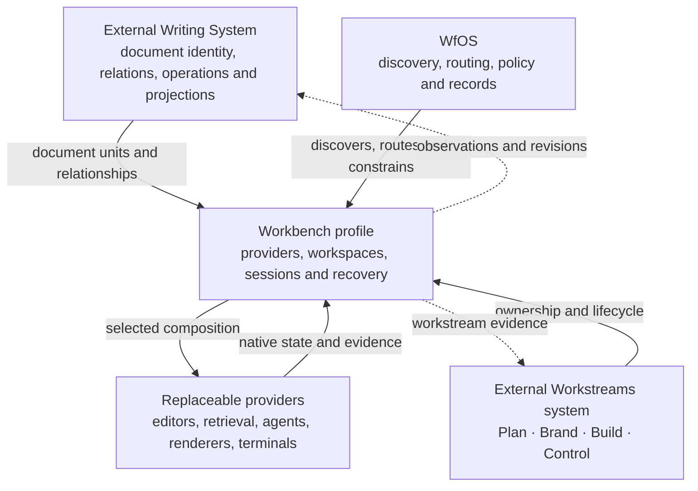
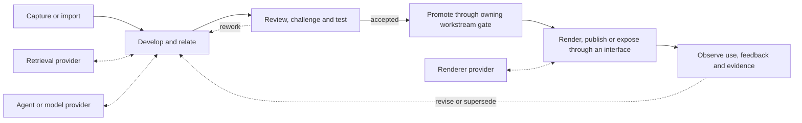
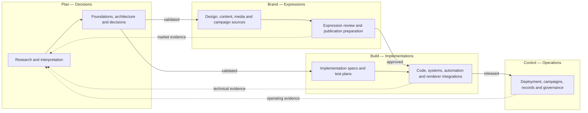
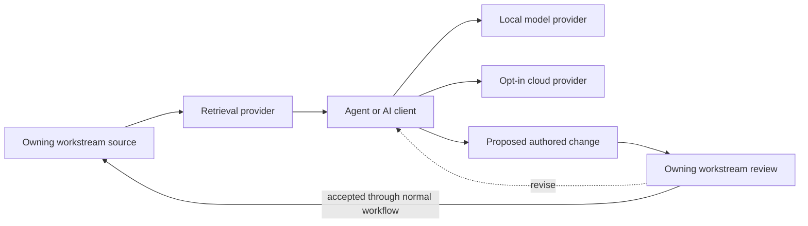
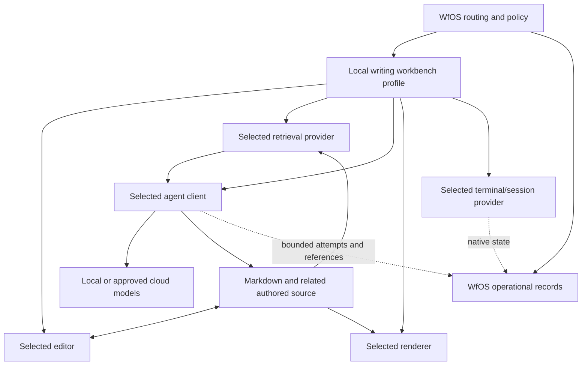

# Core workflow apps and provider profiles

WfOS can integrate local-first tools for writing, retrieval, agent assistance, rendering, terminals, and workspace restoration. These tools are **providers and profile choices**, not WfOS architecture requirements.

The durable contracts are:

- authored source remains in files and repositories the operator owns;
- the external Writing System owns document identity, relationships, transformation, review, and projection semantics;
- Workstreams owns output, lifecycle, and promotion boundaries;
- a Workbench profile selects providers, workspaces, sessions, and recovery behavior;
- WfOS may discover, route, constrain, and record provider use without absorbing provider identity or authority.

None of the tools below is installed by `panoply bootstrap` unless a separate implementation plan explicitly adds that behavior.

Status legend: **example default** · **optional alternative** · **reference only**.

---

## 1. Architecture before providers

The writing and knowledge workflow should be read in this order:


```mermaid
flowchart TD
  WritingSystem[External Writing System<br/>document identity, relations, operations and projections]
  Workstreams[External Workstreams system<br/>Plan · Brand · Build · Control]
  Workbench[Workbench profile<br/>providers, workspaces, sessions and recovery]
  WfOS[WfOS<br/>discovery, routing, policy and records]
  Providers[Replaceable providers<br/>editors, retrieval, agents, renderers, terminals]

  WritingSystem -->|document units and relationships| Workbench
  Workstreams -->|ownership and lifecycle| Workbench
  Workbench -->|selected composition| Providers
  WfOS -->|discovers, routes and constrains| Workbench
  Providers -->|native state and evidence| Workbench
  Workbench -.->|observations and revisions| WritingSystem
  Workbench -.->|workstream evidence| Workstreams
```

This is a semantic and composition view. It prevents an editor, note application, RAG tool, terminal, or AI client from becoming the source of truth for the entire workflow.

### Authority boundaries

| Concern | Authority |
|---|---|
| Document content and declared meaning | authored files in the owning workstream |
| Document identity and relationship model | Writing System contracts |
| Output ownership and promotion | Workstreams |
| Profile composition and desired provider state | Workbench profile |
| Discovery, policy projection, command routing and operational records | WfOS |
| Native editor, terminal, model, renderer or retrieval behavior | selected provider |
| Branches, commits and ancestry | Git |

---

## 2. Example local writing profile

The following is one optional local profile, not the WfOS product set:

| Capability | Example provider | Role | Posture |
|---|---|---|---|
| Quick capture | [Logseq](https://logseq.com/) | low-friction notes, research and journaling | optional |
| Long-form editing | [Obsidian](https://obsidian.md/) | structured Markdown documents and relationships | optional |
| Open-source document workspace | [SilverBullet](https://silverbullet.md/) | hackable local Markdown interface | optional alternative |
| Typesetting | [Typst](https://typst.app/) | render source into publish-grade documents | optional |
| Retrieval | [QMD](https://github.com/tobi/qmd) | local hybrid search and bounded retrieval | optional |
| Local AI client | [aichat](https://github.com/sigoden/aichat) | sessions, RAG, tools and provider routing | optional |
| Local model runtime | [Ollama](https://ollama.com/) | local model execution | optional |
| Cloud model routing | [OpenRouter](https://openrouter.ai/) | opt-in cloud model access | optional |
| Terminal sessions | tmux / zellij / Herdr | persistent or multiplexed terminal workspaces | provider choice |

Any provider may be omitted, replaced, or used outside WfOS. The profile remains valid only if its durable responsibilities survive provider replacement.

---

## 3. Provider-neutral document loop

A document workflow is recursive rather than a capture-to-publish waterfall.


```mermaid
flowchart LR
  Capture[Capture or import]
  Develop[Develop and relate]
  Review[Review, challenge and test]
  Promote[Promote through owning workstream gate]
  Project[Render, publish or expose through an interface]
  Observe[Observe use, feedback and evidence]

  Capture --> Develop --> Review
  Review -->|accepted| Promote
  Review -.->|rework| Develop
  Promote --> Project --> Observe
  Observe -.->|revise or supersede| Develop

  Retrieval[Retrieval provider] <-.-> Develop
  Agent[Agent or model provider] <-.-> Develop
  Renderer[Renderer provider] <-.-> Project
```

A short note may use only Capture and Develop. A system foundation may loop through research, review, validation, Build proofs, and later revision many times.

---

## 4. Workstreams placement

Tools do not determine workstream ownership. The **output being produced** determines ownership.


```mermaid
flowchart LR
  subgraph Plan [Plan — Decisions]
    PResearch[Research and interpretation]
    PFoundation[Foundations, architecture and decisions]
  end

  subgraph Brand [Brand — Expressions]
    BExpression[Design, content, media and campaign sources]
    BPublish[Expression review and publication preparation]
  end

  subgraph Build [Build — Implementations]
    BSpec[Implementation specs and test plans]
    BImpl[Code, systems, automation and renderer integrations]
  end

  subgraph Control [Control — Operations]
    COperate[Deployment, campaigns, records and governance]
  end

  PResearch --> PFoundation
  PFoundation -->|validated| BExpression
  PFoundation -->|validated| BSpec
  BExpression --> BPublish
  BPublish -->|approved| BImpl
  BSpec --> BImpl
  BImpl -->|released| COperate

  COperate -.->|operating evidence| PResearch
  BImpl -.->|technical evidence| PResearch
  BPublish -.->|market evidence| PResearch
```

Examples:

- an editor may be used in every workstream;
- Typst source implementing a reusable rendering pipeline belongs in Build, while a published brand brochure source may belong in Brand;
- a research note belongs in Plan when it informs a decision, but campaign performance records may belong in Control and their interpretation may produce a new Brand or Plan unit;
- implementation specifications belong in Build, not Plan, even when they derive from a validated Plan foundation.

---

## 5. Retrieval provider example — QMD

QMD is one optional local retrieval provider for Markdown collections. It can index a corpus and return bounded snippets or line ranges to an agent.

Suggested profile bindings may include:

- `Plan/bin/` — active foundations and research;
- `Plan/src/` — maintained Plan canon where present;
- `Brand/` — expression sources and research where useful;
- `Build/bin/` — implementation specifications;
- `wfos/docs/` — WfOS implementation reference;
- another Writing System collection selected by the profile.

Example installation and use:

```bash
npm install -g @tobilu/qmd
qmd collection add ~/path/to/markdown --name mynotes
qmd context add qmd://mynotes "Description for ranking"
qmd update && qmd embed
qmd query "..." -n 5
qmd get "#docid:120:40"
```

QMD indexes and retrieves. It does not become the authority for document content, relationships, gate state, or Git history.

First use may download local model assets. Provider-specific requirements and behavior should be verified against the provider's current documentation before a profile is promoted.

---

## 6. Agent and model provider example

A local AI client can read retrieved context, maintain a session, call tools, and write proposed output back into an owning workstream.


```mermaid
flowchart LR
  Source[Owning workstream source]
  Retrieval[Retrieval provider]
  AgentClient[Agent or AI client]
  LocalModel[Local model provider]
  CloudModel[Opt-in cloud provider]
  Proposal[Proposed authored change]
  Review[Owning workstream review]

  Source --> Retrieval
  Retrieval --> AgentClient
  AgentClient --> LocalModel
  AgentClient --> CloudModel
  AgentClient --> Proposal
  Proposal --> Review
  Review -.->|revise| AgentClient
  Review -->|accepted through normal workflow| Source
```

Important boundaries:

- cloud access is opt-in according to profile and policy;
- an agent proposal is not automatically validated, approved, released, or operationally authorized;
- model output should retain provenance and review context appropriate to the task;
- WfOS policy may gate commands and scope, but the owning workstream determines artifact meaning and promotion.

Example provider setup:

```bash
brew install aichat ollama
ollama pull llama3.1
ollama serve

aichat --rag notes
aichat --serve
```

Provider names and commands are examples, not stable WfOS contracts.

---

## 7. Renderer provider example — Typst

Typst can serve as one renderer for documents, reports, briefs, diagrams, and publication artifacts.

Keep these responsibilities separate:

```text
source meaning and identity
  Writing System + owning workstream

renderer adapter and build behavior
  Build implementation

brand expression source and visual direction
  Brand

published or distributed operating record
  Control where applicable

Typst compiler behavior
  Typst provider
```

The renderer should be replaceable without changing the stable identity of the source document or the owning workstream.

Example installation:

```bash
brew install typst
```

---

## 8. Editors and note applications

Editors and note applications are interfaces over source, not the source of truth by default.

### Logseq

Useful for rapid block-oriented capture, daily notes, and research. Treat any provider-specific block identifiers or database behavior as adapter concerns unless explicitly adopted into the Writing System contract.

### Obsidian

Useful for long-form Markdown, backlinks, graph views, and plugins. A repository may be opened as a vault, but vault configuration should not silently redefine workstream ownership or document authority.

### SilverBullet

Useful as an open-source and programmable Markdown interface. Its scripts and metadata may prove interface ideas while remaining replaceable.

The correct provider depends on the active profile and workflow. A user who does not benefit from a provider should be able to remove it without invalidating the underlying system.

---

## 9. Sessions and workspace restoration

A provider profile may also compose terminal, desktop, browser, file, and agent session providers.

| Capability | Example providers | Boundary |
|---|---|---|
| Terminal persistence and multiplexing | tmux, zellij, Herdr | provider owns PTYs, panes and native session state |
| Desktop workspace switching | FlashSpace or selected desktop provider | provider owns window/space state |
| Resource dashboard | Freeter or custom interface | interface projection, not source authority |
| Agent session history | selected agent provider | provider-native history; durable summaries belong in authored records where required |
| WfOS command records | runtime-controller | operational attempts and policy results, not full provider session replacement |

WfOS may coordinate providers through adapters, profiles, and records. It must not become a second terminal server, desktop window manager, editor database, or agent-history provider.

A Workbench profile should distinguish:

```text
declared desired state
provider live state
durable authored state
derived registry state
ephemeral session state
secret state
recovery evidence
```

---

## 10. Example profile flow


```mermaid
flowchart TD
  Profile[Local writing workbench profile]
  Files[Markdown and related authored source]
  Editor[Selected editor]
  Retrieval[Selected retrieval provider]
  Agent[Selected agent client]
  Models[Local or approved cloud models]
  Renderer[Selected renderer]
  Terminal[Selected terminal/session provider]
  Records[WfOS operational records]

  Profile --> Editor
  Profile --> Retrieval
  Profile --> Agent
  Profile --> Renderer
  Profile --> Terminal

  Files <--> Editor
  Files --> Retrieval
  Retrieval --> Agent
  Agent --> Models
  Agent --> Files
  Files --> Renderer

  WfOS[WfOS routing and policy] --> Profile
  WfOS --> Records
  Terminal -. native state .-> Records
  Agent -. bounded attempts and references .-> Records
```

This is one composition profile. It should be tested for provider omission, replacement, failure, resume, recovery, and teardown before being promoted as a durable Workbench pattern.

---

## 11. Quick-start example

These commands manually install one optional provider set. They are not part of the WfOS bootstrap contract.

```bash
# CLI providers
brew install aichat ollama typst

# Retrieval provider
npm install -g @tobilu/qmd

# Optional GUI editors
brew install --cask obsidian logseq

# Local model example
ollama pull llama3.1
ollama serve

# Retrieval example
qmd collection add ~/path/to/markdown --name mynotes
qmd update && qmd embed
```

Do not encode a provider as required architecture merely because it appears in this example.

---

## 12. Relationship to WfOS

WfOS responsibilities in this area are bounded:

- discover provider capabilities and profile bindings;
- route approved commands;
- apply metadata-plane policy;
- expose scoped agent or CLI interfaces;
- record operational attempts and results;
- project relationships and gateway state;
- support provider adapters without absorbing provider internals.

WfOS does **not** own:

- the external Writing System;
- Workstreams output ownership;
- editor-native databases;
- terminal PTYs and pane state;
- Git history;
- model-provider behavior;
- renderer semantics;
- desktop window geometry.

See:

- [architecture.md](architecture.md) — WfOS boundaries and Workstreams integration
- [tool-catalog.md](tool-catalog.md) — broader provider catalog
- [native-toolchain.md](native-toolchain.md) — native CLI substrate
- [runtime-architecture.md](runtime-architecture.md) — controller/provider coordination boundary
