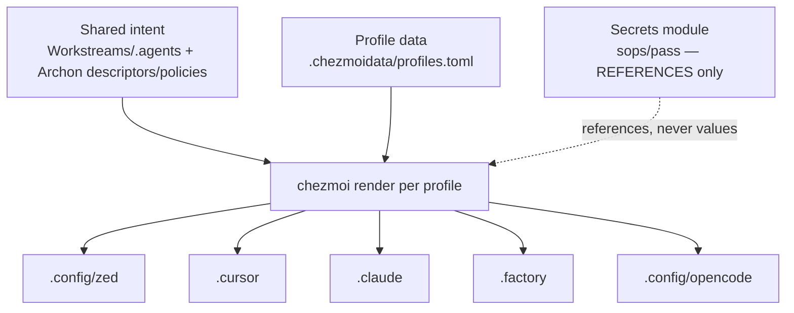

# Config routing rules

How configuration is layered so that **shared intent lives in registries**, **app-specific syntax
lives in app configs**, and an agent can read the registry instead of every app's prose. The
machine-readable form of this contract is [`.chezmoidata/routing.toml`](.chezmoidata/routing.toml);
this doc is the human-readable rationale.

## Three layers

| Layer | Home | What it holds | Who reads it |
|-------|------|---------------|--------------|
| Shared intent | `Workstreams/.agents/` + archon `descriptors`/`policies` | cross-app rules, scopes, allowed/blocked paths, command policy | agents (one read) |
| Profile data | `dotfiles/.chezmoidata/` | which targets render per profile; non-secret config values | chezmoi at render time |
| App syntax | each app's own config file (`.config/zed`, `.cursor`, `.claude`, …) | only the app-specific *expression* of the shared intent | the app |

The dotfiles are the **render target**, never the source of truth. Intent flows down; secrets never
flow in.



## The four rules

1. **No secrets in dotfiles.** Dotfiles hold non-secret config only; secret *references* (sops/pass)
   are wired via the [secrets module](../../../docs/native-substrate.md). Enforced by the no-secrets
   scan in [`bin/validate.sh`](bin/validate.sh).
2. **No app config is the policy source of truth.** Policy lives in archon descriptors/policies and
   `Workstreams/.agents/`. An app config is a downstream *expression*, never the canon.
3. **Cross-app rules route through `Workstreams/.agents/` + archon descriptors**, so one read
   answers "what may this agent touch" instead of crawling each app's prose. See
   [metadata-plane](../../../docs/metadata-plane.md) and [agent-rails](../../../docs/agent-rails.md).
4. **App configs consume shared profile data.** Each app config is rendered by chezmoi from the same
   `.chezmoidata` profile data, so the `agent-safe`/`headless-dev` profiles narrow every app at once.

## Pattern (future per-app templates)

Per-app config templates are owned by the metadata plane / agent-config layer. The pattern each
will follow — consuming shared profile data instead of forking policy — looks like:

```gotmpl
{{/* dot_config/zed/settings.json.tmpl — consumes shared profile data, holds no policy */}}
{{- $p := index .profiles .profile -}}
{
  "telemetry": { "metrics": {{ $p.gui }} },
  "assistant": { "enabled": {{ $p.gui }} }
  // app-specific Zed syntax only; scopes/policy stay in Workstreams/.agents
}
```

## Token-cost impact

Medium. Keeps the "one source of truth" property: an agent reads the registry / `.agents` profile
once instead of holding every app's prose config in context. See
[metadata-plane](../../../docs/metadata-plane.md) (registry-as-context-cache) and
[agent-rails](../../../docs/agent-rails.md) (lean shared profiles).

## Related

- [`.chezmoidata/routing.toml`](.chezmoidata/routing.toml) — machine-readable routing contract
- [`README.md`](README.md) — source layout + profiles
- [`../../../docs/metadata-plane.md`](../../../docs/metadata-plane.md) — metadata plane / `Workstreams/.agents`
- [`../../../docs/agent-rails.md`](../../../docs/agent-rails.md) — agent configs & profiles
