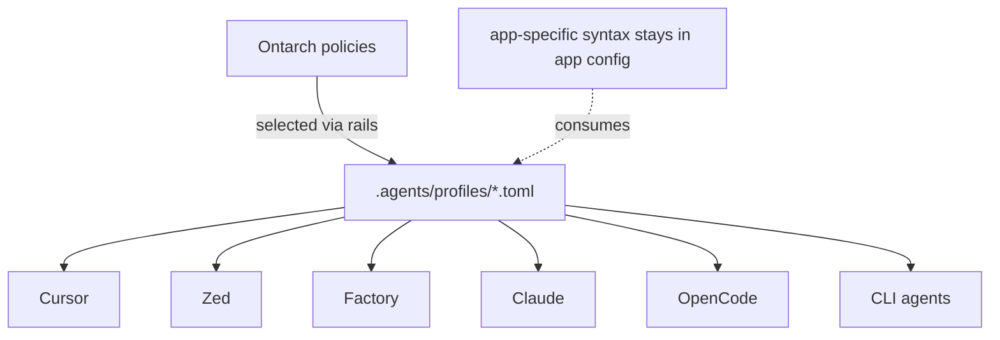

# .agents/profiles — agent operating profiles

Agent operating profiles: the bounded views and rails an agent runs under (which commands,
paths, secrets, and tools a profile may touch). **One profile declaration is consumed by every
agent app** instead of being duplicated as prose in five places. Apps consume the shared intent
via their own config syntax; the intent lives here.

Ontarch **policies remain the enforcement authority**. A profile *selects* a policy via `rails`
and *scopes* it; it never becomes a second policy source of truth. Profiles authored here are
validated by `moon run ontarch:validate` and indexed into `registry/profiles.json` by
`moon run ontarch:sync` (generated, gitignored).

## Example profiles (seed)

| id | purpose | rails | isolation | remote writes | loads skills |
|----|---------|-------|-----------|---------------|--------------|
| `docs-only` | docs/specs only — no code, config, or secrets | `no-agent-git-push` | branch | blocked | no |
| `workspace-dev` | edit code, run moon tasks, stage commits | `panoply.agent` | worktree | local-only | yes |
| `agent-safe-maintenance` | toolkit-wide read + gated cleanup under `PANOPLY_AGENT=1` | `panoply.agent` | worktree | blocked | yes |

Seed examples use **generic path globs**. Customize `allowed_paths`, `blocked_paths`, and
`session_log_target` for your workspace layout after `ontarch agents-init`.

`rails` selects the profile’s primary Ontarch policy. The cross-cutting `agent-git` policy
(`applies_to = "agent"`) still governs git allow/gate/block via the graph; profile
`[commands]` lists must not contradict it.

## Contract (one TOML file per profile)

Every profile declares the fields below. The file is parsed by the Ontarch TOML reader
(`lib/descriptor.sh`), so it must stay inside that subset: top-level
`k = "v" | true/false | n | ["a","b"]`, flat `[table]` sections, single-line inline arrays with
double-quoted elements, **no nested tables, no inline comments** (whole-line `#` only).

```toml
id = "docs-only"                       # ^[a-z0-9][a-z0-9._-]*$  (required)
title = "Documentation-only agent"
purpose = "Maintain docs only; never touch code, config, or secrets"   # required
rails = "no-agent-git-push"            # the Ontarch policy this profile selects

[scope]
allowed_paths = ["docs/**", "bin/**"]  # required, non-empty — customize per workspace
blocked_paths = [".env*", "secrets/**"]

[commands]
allowed_commands = ["git status", "git diff"]
gated_commands   = ["git add", "git commit"]
blocked_commands = ["git push", "rm -rf"]

[policy]
secret_access       = false
remote_write_policy = "blocked"        # blocked | local-only | elevated

[isolation]
mode = "branch"                        # worktree | branch | main
jj   = "opt-in"                        # opt-in | default | off

[skills]
loads_external = false                 # true => required_validators MUST include skillspector_scan

[validators]
required_validators = ["markdown_links", "frontmatter"]

[logs]
session_log_target = "packages/ontarch/registry/sessions"

# Optional operational Takogami state home (distinct from logs.session_log_target):
# [runtime]
# session_state_home = "/path/to/takogami/sessions"
```

### Field reference

| Field | Meaning |
|-------|---------|
| `id`, `title`, `purpose` | identity + one-line intent (id and purpose are required) |
| `rails` | the Ontarch policy id this profile runs under |
| `scope.allowed_paths` / `blocked_paths` | the only paths a task may read/write |
| `commands.allowed_commands` | commands the profile may run freely |
| `commands.gated_commands` | commands allowed only with a human gate |
| `commands.blocked_commands` | hard-blocked commands |
| `policy.secret_access` | may the profile read secrets? Default `false` |
| `policy.remote_write_policy` | `blocked` · `local-only` · `elevated` |
| `isolation.mode` | `worktree` · `branch` · `main` |
| `isolation.jj` | `opt-in` (sanctioned) · `default` · `off` |
| `skills.loads_external` | may load third-party skills? Requires `skillspector_scan` when true |
| `validators.required_validators` | gates a change must pass |
| `output.compressor` | optional (`rtk`); omit to opt out |
| `logs.session_log_target` | build-session provenance path (never operational Takogami state) |
| `runtime.session_state_home` | optional operational Takogami state override |

## How apps consume a profile



Rules: keep shared policy in the registry · keep app-specific syntax in app config · do not
duplicate secrets across agent configs · do not let app configs bypass toolkit rails · prefer one
task per agent session · require logs for autonomous routines.
